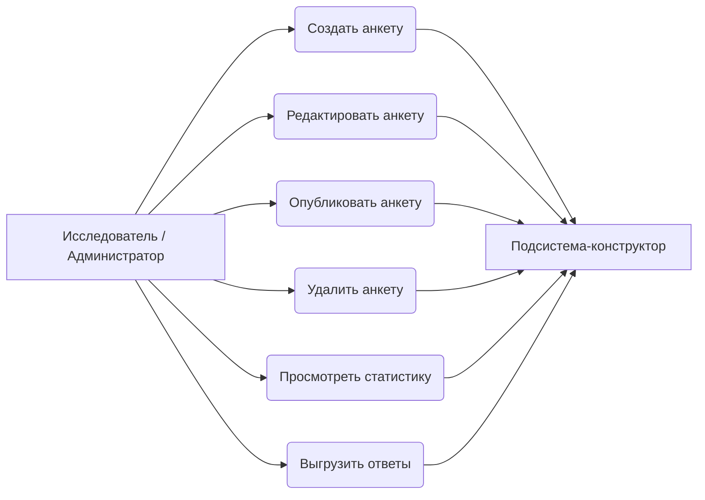
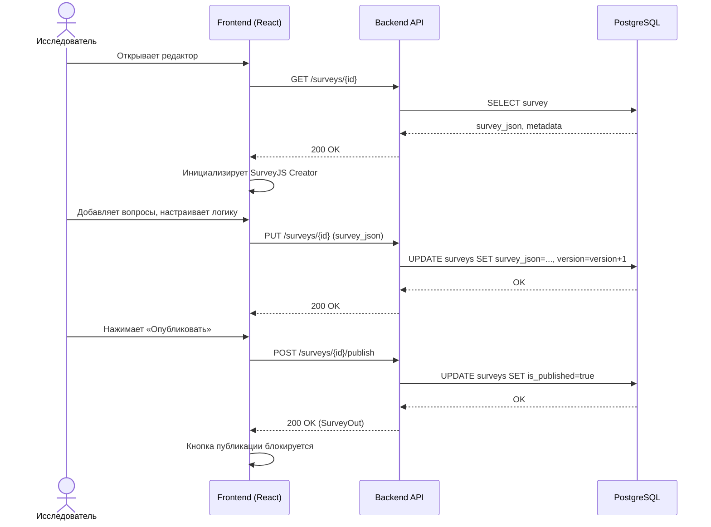
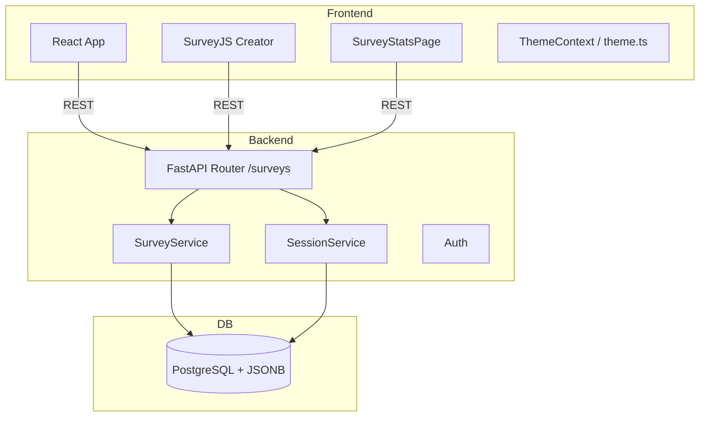

# Подсистема-конструктор анкетирования АСНИ социологических данных

*Фрагмент пояснительной записки к выпускной квалификационной работе (назначение, требования, диаграмма, описание интерфейса и программной реализации подсистемы).*

---

## 2. Подсистема-конструктор анкетирования

### 2.1. Назначение подсистемы и её место в архитектуре АСНИ

Подсистема-конструктор анкетирования входит в АСНИ социологических данных как модуль, который позволяет исследователю спроектировать электронную форму опроса без написания кода, сохранить машиночитаемое описание анкеты в базу данных и провести анкету через весь жизненный цикл — от черновика до публикации.

Конструктор реализует визуальное составление анкеты (no-code сценарий через редактор SurveyJS), а также настройку логики: ветвление, условия отображения элементов. Персонализация доступа респондентов и возможность приостановить и продолжить заполнение относятся к подсистеме проведения анкетирования; конструктор отвечает только за корректное описание структуры и логики, которые затем используются при прохождении опроса.

Границы ответственности: конструктор не занимается сбором ответов и статистическим анализом. Он формирует и версионирует метаданные анкеты (`survey_json`) и признак публикации — всё, что нужно подсистемам хранения данных и проведения опроса.

---

### 2.2. Требования к подсистеме-конструктору

#### 2.2.1. Функциональные требования

Обозначения приоритетов: О — обязательное (Must), Ж — желательное (Should), В — возможное (Could).

Таблица 2.1 — Функциональные требования к подсистеме-конструктору анкетирования

| ID | Формулировка требования | Приоритет |
|----|-------------------------|-----------|
| К.1.01 | Пользователь с правами исследователя или администратора создаёт новую анкету и открывает её в режиме редактирования | О |
| К.1.02 | Подсистема предоставляет визуальный редактор структуры анкеты (страницы, типы вопросов, свойства элементов) без написания программного кода | О |
| К.1.03 | Описание анкеты сохраняется в виде JSON-документа по схеме SurveyJS, совместимого с исполнителем анкеты в подсистеме проведения опроса | О |
| К.1.04 | Изменения черновика автоматически сохраняются на сервер; операция доступна только ролям исследователя и администратора | Ж |
| К.1.05 | Ручное сохранение черновика по команде пользователя | О |
| К.1.06 | При изменении JSON-описания анкеты сервер увеличивает номер версии | О |
| К.1.07 | Исследователь публикует анкету; после публикации анкета доступна подсистеме проведения анкетирования по идентификатору | О |
| К.1.08 | После первого успешного опубликования повторная публикация через интерфейс конструктора не требуется (кнопка блокируется) | В |
| К.1.09 | Исследователь может удалить анкету, которая больше не нужна | Ж |
| К.1.10 | Подсистема поддерживает настройку логики анкеты через вкладку логики редактора SurveyJS Creator | Ж |
| К.1.11 | Исследователь настраивает сроки проведения анкеты: дату начала и окончания приёма ответов | О |
| К.1.12 | Исследователь задаёт максимальное количество ответов (max_responses); после достижения лимита новые сессии не принимаются | Ж |
| К.1.13 | Исследователь может разрешить или запретить анонимное прохождение (allow_anonymous) | Ж |
| К.1.14 | Администратор просматривает статистику анкеты: количество сессий, завершённость, средний прогресс, распределение ответов по вопросам | О |
| К.1.15 | Администратор выгружает ответы в формате JSON или CSV с возможностью анонимизации и включения незавершённых сессий | Ж |

#### 2.2.2. Нефункциональные требования

Таблица 2.2 — Нефункциональные требования

| ID | Формулировка | Приоритет |
|----|----------------|-----------|
| К.2.01 | Доступ к созданию, изменению, публикации и удалению анкеты защищён аутентификацией и авторизацией по роли | О |
| К.2.02 | Обмен данными между браузером и сервером идёт по HTTPS; API документируется в формате OpenAPI (Swagger) | Ж |
| К.2.03 | Описание анкеты хранится в СУБД в полуструктурированном виде (JSON/JSONB) — это даёт гибкость схемы вопросов | О |
| К.2.04 | Операции сохранения выполняются с задержкой порядка 1 с, что позволяет использовать автосохранение без потери работоспособности интерфейса | В |
| К.2.05 | Поддержка тёмной и светлой темы интерфейса с сохранением выбора в localStorage | В |

---

### 2.3. Диаграмма прецедентов

Рисунок 2.1 — Диаграмма прецедентов подсистемы-конструктора

---

### 2.4. Диаграмма последовательности (основной сценарий)

Рисунок 2.2 — Последовательность создания и публикации анкеты

---

### 2.5. Диаграмма компонентов

Рисунок 2.3 — Компоненты подсистемы-конструктора

---

### 2.6. Описание программной реализации

#### 2.6.1. Клиентский модуль (`frontend/`)

`AdminSurveyEditorPage.tsx` — страница редактирования анкеты. Загружает существующую анкету по `id` или создаёт новую. Инициализирует SurveyJS Creator с вкладками дизайна, логики и предпросмотра. Реализует автосохранение (`autoSaveEnabled`) с задержкой 1 с. Публикация выполняется отдельной кнопкой, которая вызывает `POST /surveys/{id}/publish` и блокируется после первой успешной публикации (`К.1.08`). Удаление анкеты — через `DELETE /surveys/{id}` с подтверждением.

`AdminSurveysListPage.tsx` — страница списка анкет. Отображает таблицу с заголовками, датами создания, статусом публикации (черновик / опубликовано). Поддерживает создание новой анкеты (`POST /surveys` с начальным `survey_json`), переход к редактору, копирование публичной ссылки (`/s/{id}`) в буфер обмена, удаление.

`SurveyStatsPage.tsx` — страница статистики анкеты. Загружает данные анкеты, агрегированную статистику (`GET /surveys/{id}/stats`) и список сессий (`GET /surveys/{id}/sessions`). Отображает сводные карточки (всего сессий, завершено, в процессе, процент завершения, средний прогресс), линейный прогресс-бар завершённости, распределение ответов по каждому вопросу в виде горизонтальных шкал, таблицу сессий с респондентом, статусом, прогрессом, временем начала и завершения. Содержит кнопки экспорта в CSV и JSON (ссылки на `/api/v1/surveys/{id}/export`).

`theme.ts` — конфигурация Material-UI темы с двумя режимами: светлый (`light`) и тёмный (`dark`). Определяет цветовую палитру (primary `#003399`, success `#059669`, error `#DC2626`), типографику (`Inter`), скругление (`borderRadius: 8`), стили кастомных компонентов (AppBar, Button, Card, Table, Chip, Alert, LinearProgress).

`ThemeContext.tsx` — React-контекст для управления текущей темой.

`AppRoot.tsx` — корневой компонент приложения. Инициализирует тему из `localStorage` (`theme_mode`), предоставляет переключатель `toggleTheme`, оборачивает приложение в `ThemeProvider`, `CssBaseline` и `BrowserRouter`.

`api.ts` — слой API-клиента. Основан на axios: таймаут 30 с, автоматическая подстановка Bearer-токена из `localStorage`, перехватчик 401 (очищает авторизацию и перенаправляет на `/login`). Типизированные хелперы для всех backend-эндпоинтов.

#### 2.6.2. Серверный модуль (`backend/`)

`app/api/v1/surveys.py` — маршруты CRUD для анкет.

- `POST /surveys` (`create_survey`) — создаёт анкету. Требует роль `admin`. Принимает `title`, `description`, `survey_json`.
- `GET /surveys` (`list_surveys`) — список всех анкет, сортировка по `created_at DESC`. Доступен любому авторизованному пользователю.
- `GET /surveys/{survey_id}` (`get_survey`) — возвращает анкету по UUID. Доступен любому авторизованному пользователю.
- `PUT /surveys/{survey_id}` (`update_survey`) — обновляет поля анкеты. При изменении `survey_json` автоматически инкрементирует `version`. Требует роль `admin`.
- `POST /surveys/{survey_id}/publish` (`publish_survey`) — выставляет `is_published=True` и `published_at`. Требует роль `admin`.
- `DELETE /surveys/{survey_id}` (`delete_survey`) — удаляет анкету и связанные сессии (каскадное удаление через `ON DELETE CASCADE`). Требует роль `admin`.
- `GET /surveys/{survey_id}/stats` (`survey_stats`) — возвращает агрегированную статистику: `total_sessions`, `completed_sessions`, `in_progress_sessions`, `completion_rate`, `avg_progress_pct`, `responses_by_question` (распределение ответов по вопросам). Доступен любому авторизованному пользователю.
- `GET /surveys/{survey_id}/sessions` (`list_sessions`) — возвращает список сессий с возможностью фильтрации по `respondent_id` и `completed_only`. Доступен любому авторизованному пользователю.
- `GET /surveys/{survey_id}/export` (`export_survey`) — экспортирует ответы в JSON или CSV. Параметры: `format` (`json`/`csv`), `anonymize` (удаляет `respondent_id`), `include_incomplete` (включает незавершённые сессии). Требует роль `admin`.

`app/services/survey_service.py` — доменный сервис анкет.

- `list_surveys`, `get_survey`, `create_survey`, `update_survey`, `publish_survey`, `delete_survey` — стандартные CRUD-операции с валидацией доступа на уровне роутов.
- `get_stats` — собирает статистику по сессиям анкеты: считает завершённые и активные сессии, вычисляет `completion_rate` и `avg_progress_pct`, агрегирует ответы по вопросам (счётчик значений, включая множественный выбор).
- `completed_response_count` — возвращает количество завершённых сессий для анкеты (используется при проверке `max_responses` в подсистеме проведения).
- `get_public_survey` — проверяет доступность анкеты для респондентов: `is_published=True`, сроки (`starts_at`/`ends_at`, `start_date`/`end_date`) не истекли.

`app/models/survey.py` — ORM-модель таблицы `surveys`.

Поля:
- `title` (String 200) — заголовок анкеты;
- `description` (String 500, nullable) — описание;
- `survey_json` (JSONB) — схема SurveyJS;
- `is_published` (Boolean, default=False) — признак публикации;
- `version` (Integer, default=1) — версия схемы;
- `published_at` (DateTime, nullable) — время публикации;
- `start_date`, `end_date` (DateTime, nullable) — административные сроки проведения;
- `starts_at`, `ends_at` (DateTime, nullable) — сроки приёма ответов (проведение);
- `max_responses` (Integer, nullable) — максимальное количество ответов;
- `allow_anonymous` (Boolean, default=True) — разрешение анонимного прохождения.

`app/schemas/survey.py` — Pydantic-схемы.

- `SurveyCreate` — обязательные поля для создания.
- `SurveyUpdate` — все поля опциональны; позволяет частичное обновление.
- `SurveyOut` — полная модель для ответа клиенту, включает `created_at`, `published_at` и все поля проведения.
- `SurveyStats` — схема статистики: `survey_id`, `total_sessions`, `completed_sessions`, `in_progress_sessions`, `completion_rate`, `avg_progress_pct`, `responses_by_question`.

#### 2.6.3. Развёртывание

Приложение запускается через Docker Compose. Файл `docker-compose.yml` описывает два сервиса: базу данных и API.

Сервис `survey-db`:

- образ `postgres:16`;
- база данных `survey_db`, пользователь `survey`;
- данные хранятся в именованном томе `survey_pgdata`, поэтому при перезапуске контейнера не теряются;
- для проверки готовности настроен healthcheck: `pg_isready -U survey -d survey_db` с интервалом 5 секунд;
- порт 5432 внутри контейнера проброшен на 5433 хоста, чтобы не конфликтовать с локальным PostgreSQL.

Сервис `survey-api`:

- собирается из `backend/Dockerfile`: базовый образ `python:3.11-slim`, устанавливается `postgresql-client` для работы `pg_isready` в скрипте запуска, далее устанавливаются зависимости из `requirements.txt`, копируются исходники, `alembic.ini` и `alembic/`, скрипт `entrypoint.sh`;
- переменные окружения берутся из файла `backend/.env`: строка подключения к БД (`DATABASE_URL`), список разрешённых источников CORS (`CORS_ORIGINS`), флаг отладки (`DEBUG`);
- сервис запускается только после того, как `survey-db` прошёл healthcheck (`condition: service_healthy`);
- при сбое контейнер перезапускается (`restart: on-failure`);
- порт 8000 внутри контейнера проброшен на 8001 хоста.

При старте контейнера выполняется `entrypoint.sh`:

1. цикл ожидания PostgreSQL через `pg_isready`;
2. применение миграций: `alembic upgrade head`;
3. запуск сервера: `uvicorn app.main:app --host 0.0.0.0 --port 8000`.

Такая схема позволяет поднять всё окружение одной командой `docker compose up` без предварительной ручной настройки базы данных.

---

#### 2.6.4. E2E-тестирование

В CI (GitHub Actions) на каждый push и PR поднимается весь стек через Docker Compose, а Python-скрипты ходят по живым эндпоинтам — nginx → FastAPI → PostgreSQL.

`e2e_smoke.py` — быстрая проверка, что деплой не упал. Регистрирует админа, логинится, создаёт анкету, публикует, имитирует автосохранение, стартует публичную сессию, проходит её до конца и проверяет ответы. Если что-то пойдёт не так — пайплайн останавливается.

`e2e_survey_lifecycle.py` — полный цикл CRUD: создать анкету, получить список, прочитать по id, обновить, опубликовать, проверить через публичный API, удалить и убедиться, что она исчезла из списка.

Скрипты на чистом `urllib`, без внешних зависимостей. Имена пользователей содержат timestamp — так тесты не мешают друг другу при параллельных запусках.

---

### 2.7. Взаимодействие с другими подсистемами АСНИ

- Подсистема хранения данных — конструктор читает и записывает данные в PostgreSQL; `survey_json` хранится как JSONB.
- Подсистема проведения анкетирования — после публикации получает анкету по публичному API (`/api/v1/public/surveys/{id}`); логика исполняется на клиенте SurveyJS по сохранённому `survey_json`. Подсистема проведения также получает параметры сроков (`starts_at`, `ends_at`, `start_date`, `end_date`), `max_responses` и `allow_anonymous`. На основании этих данных она блокирует создание новых сессий при достижении `max_responses`, требует `respondent_id`, если `allow_anonymous=False`, и проверяет сроки при каждом сохранении прогресса.
- Идентификация и доступ — JWT и роли пользователей для административных операций.

---

### 2.8. Ограничения и допущения текущей версии (MVP)

Одновременное редактирование одной анкеты несколькими пользователями не поддерживается — механизм блокировок не реализован. Полная история правок JSON не ведётся, хранится только скалярный счётчик `version`. Набор типов вопросов определяется возможностями SurveyJS. Описание анкеты на сервере ограничено полями, которые принимает API.

---

*Конец фрагмента. Номера рисунков и таблиц при вставке в пояснительную записку привести к сквозной нумерации документа. Диаграмму Mermaid можно экспортировать в PNG/SVG на https://mermaid.live для включения в PDF.*
