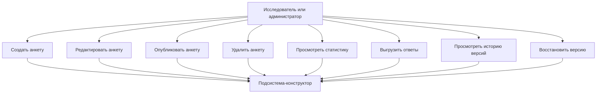
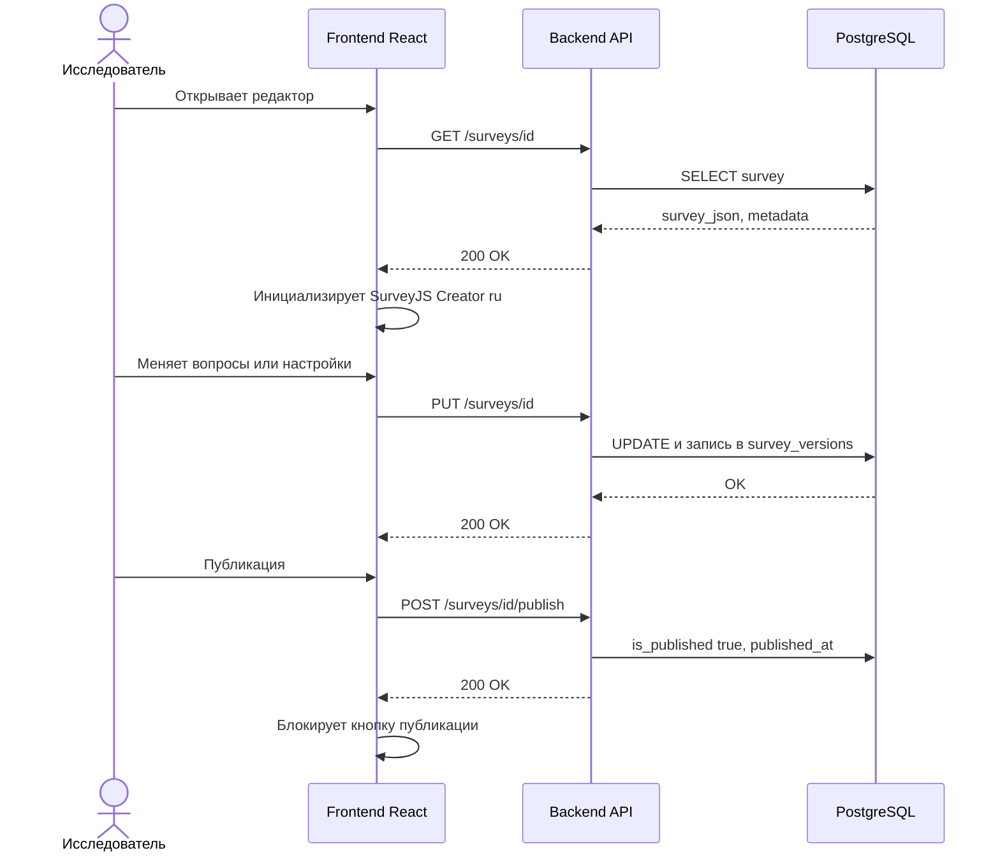
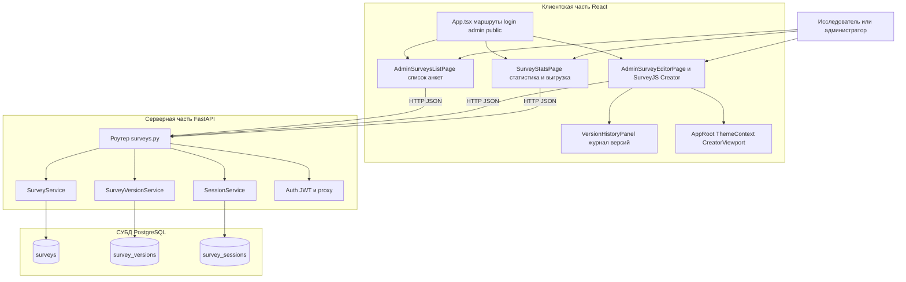

# Подсистема-конструктор анкетирования АСНИ социологических данных

Фрагмент пояснительной записки к выпускной квалификационной работе: назначение, требования, диаграммы, описание интерфейса и программной реализации подсистемы.

---

## 2. Подсистема-конструктор анкетирования

### 2.1. Назначение подсистемы и её место в архитектуре АСНИ

Подсистема-конструктор анкетирования входит в АСНИ социологических данных как модуль, в котором исследователь собирает электронную форму опроса без программирования, сохраняет машиночитаемое описание в базу и ведёт анкету от черновика до публикации.

Исследователь работает в визуальном редакторе SurveyJS Creator: вкладки Дизайн, Логика и Предпросмотр. Здесь же задаются сроки приёма ответов, лимит числа завершённых анкет, разрешение или запрет анонимного прохождения. После публикации анкета становится доступна подсистеме проведения по идентификатору и публичной ссылке вида /s/{id}. Конструктор хранит метаданные анкеты, поле survey_json, признак is_published и журнал версий в таблице survey_versions.

Сбор ответов и экран для респондента конструктору не принадлежат. Статистический анализ уровня АРМ исследователя (корреляции, кросс-таблицы на лету) тоже вне этой подсистемы. Зато исследователь видит сводку по сессиям конкретной анкеты и может выгрузить ответы в JSON или CSV.

---

### 2.2. Требования к подсистеме-конструктору

#### 2.2.1. Функциональные требования

Обозначения приоритетов: О обязательное (Must), Ж желательное (Should), В возможное (Could).

Таблица 2.1 — Функциональные требования к подсистеме-конструктору анкетирования

| ID | Формулировка требования | Приоритет |
|----|-------------------------|-----------|
| К.1.01 | Пользователь с ролью admin или researcher создаёт анкету и открывает её в режиме редактирования | О |
| К.1.02 | Подсистема предоставляет визуальный редактор структуры анкеты (страницы, типы вопросов, свойства элементов) без написания кода | О |
| К.1.03 | Описание анкеты сохраняется в JSON по схеме SurveyJS, совместимой с исполнителем в подсистеме проведения | О |
| К.1.04 | Изменения черновика автоматически сохраняются на сервер с задержкой около 1 с (только для ролей с правом редактирования) | Ж |
| К.1.05 | Ручное сохранение черновика по команде пользователя | О |
| К.1.06 | При изменении отслеживаемых полей сервер увеличивает номер версии и пишет запись в журнал survey_versions | О |
| К.1.07 | Исследователь публикует анкету; после публикации она доступна подсистеме проведения по идентификатору | О |
| К.1.08 | Повторная публикация через интерфейс конструктора не предусмотрена: кнопка блокируется после первого успешного publish | В |
| К.1.09 | Исследователь может удалить ненужную анкету; связанные сессии удаляются каскадно | Ж |
| К.1.10 | Настройка логики анкеты через вкладку Логика SurveyJS Creator; в интерфейсе есть справка по условному показу вопросов | Ж |
| К.1.11 | Настройка сроков проведения: дата и время начала и окончания приёма ответов | О |
| К.1.12 | Задание max_responses; при достижении лимита подсистема проведения не создаёт новые сессии | Ж |
| К.1.13 | Разрешение или запрет анонимного прохождения (поле allow_anonymous) | Ж |
| К.1.14 | Просмотр статистики: число сессий, завершённость, средний прогресс, распределение ответов по вопросам | О |
| К.1.15 | Выгрузка ответов в JSON или CSV; параметры include_incomplete и anonymize на уровне API | Ж |
| К.1.16 | Просмотр журнала версий: автор, время, краткое описание изменений | О |
| К.1.17 | Восстановление выбранной версии из журнала; текущее состояние сохраняется как новая версия | Ж |
| К.1.18 | В списке анкет отображается статус проведения: черновик, ещё не начато, активна, завершено | Ж |
| К.1.19 | Копирование публичной ссылки /s/{id} и открытие страницы прохождения в новой вкладке | Ж |

#### 2.2.2. Нефункциональные требования

Таблица 2.2 — Нефункциональные требования

| ID | Формулировка | Приоритет |
|----|----------------|-----------|
| К.2.01 | Создание, изменение, публикация, удаление и восстановление версий защищены JWT; роли admin и researcher имеют доступ к мутациям | О |
| К.2.02 | API описано в OpenAPI (Swagger); в продакшене предполагается HTTPS через обратный прокси | Ж |
| К.2.03 | survey_json и снимки версий хранятся в PostgreSQL как JSONB | О |
| К.2.04 | Автосохранение с интервалом около 1 с не блокирует интерфейс редактора | В |
| К.2.05 | Светлая и тёмная тема MUI и SurveyJS Creator; выбор темы сохраняется в localStorage (ключ theme_mode) | В |
| К.2.06 | Русская локализация интерфейса SurveyJS Creator и форм | Ж |
| К.2.07 | Подсистема может подключаться к оболочке АСНИ как Module Federation remote surveyConstructor | В |
| К.2.08 | При PROXY_AUTH_ENABLED=true допускается аутентификация через заголовки X-Forwarded-User и X-Forwarded-Role от доверенного прокси | В |

---

### 2.3. Диаграмма прецедентов

На рисунке 2.1 схема выстроена сверху вниз: от действий исследователя к подсистеме-конструктору. Удобно экспортировать в PNG на https://mermaid.live и вставить в Word.

Рисунок 2.1 — Диаграмма прецедентов подсистемы-конструктора

Исследователь или администратор с ролью admin или researcher создаёт анкету и открывает редактор. В редакторе меняется структура вопросов, логика показа, сроки и лимиты. Публикация делает анкету видимой для респондентов. Статистика и выгрузка нужны уже после сбора ответов. Журнал версий позволяет посмотреть, кто и когда менял анкету, и при необходимости откатиться к более раннему снимку survey_json.

---

### 2.4. Диаграмма последовательности (создание, сохранение, публикация)

Рисунок 2.2 — Последовательность создания и публикации анкеты

После входа браузер запрашивает анкету по REST. Сервер отдаёт survey_json и поля проведения. Creator инициализируется с русской локалью. Любое сохранение (автоматическое или по кнопке) уходит PUT-запросом; backend сравнивает поля, увеличивает version и добавляет строку в survey_versions. Публикация отдельным POST: выставляются is_published и published_at, в журнал пишется событие публикации. Интерфейс больше не предлагает повторно опубликовать ту же анкету.

---

### 2.5. Диаграмма компонентов

На рисунке 2.3 вертикальное разбиение: клиент React, ниже REST API на FastAPI, внизу PostgreSQL. Экспорт в PNG: https://mermaid.live.

Рисунок 2.3 — Компоненты подсистемы-конструктора

Клиентская часть, каталог frontend/src.

App.tsx задаёт маршрутизацию SPA. После входа пользователь попадает в /admin/surveys, открывает редактор /admin/surveys/:id и статистику /admin/surveys/:id/stats. Публичное прохождение идёт по /s/:surveyId в том же приложении, но верхняя административная панель на этих URL скрыта.

AdminSurveysListPage.tsx рисует таблицу анкет: заголовок, дата создания, опубликована ли анкета, статус проведения (черновик, ещё не начато, активна, завершено). Статус считается по start_date, starts_at, end_date, ends_at. Есть счётчики: всего анкет и сколько сейчас в окне приёма ответов. Доступны создание анкеты, переход в редактор, копирование ссылки /s/{id}, открытие публичной страницы, удаление. Роль student видит только список.

AdminSurveyEditorPage.tsx основной экран конструктора. SurveyJS Creator с русской локалью, автосохранением около 1 с для admin и researcher, ручным сохранением, однократной публикацией, удалением, диалогом сроков и лимитов, справкой по условной логике. CreatorViewport и EditorChromeContext при прокрутке прячут навигацию и панель инструментов Creator.

VersionHistoryPanel.tsx справа в ResizableSplitPane: список версий, diff, восстановление с подтверждением. Состояние панели в localStorage.

SurveyStatsPage.tsx: карточки метрик, распределение по вопросам, таблица сессий, ссылки на экспорт CSV и JSON.

AppRoot.tsx и ThemeContext.tsx: тема MUI, theme_mode в localStorage. theme.ts и surveyCreatorTheme.ts задают цвет primary #003399.

api.ts на axios: Bearer из localStorage, при 401 редирект на /login.

Серверная часть, каталог backend/app.

Роутер surveys.py принимает REST. Мутации через has_role(admin), на практике доступны admin и researcher. Чтение списка, анкеты, stats и versions любому активному пользователю с JWT.

SurveyService: CRUD, publish, статистика, проверки для public API, подсчёт завершённых для max_responses. При update пишется версия.

SurveyVersionService и survey_diff.py: снимки survey_json, структура changes, restore.

SessionService: список сессий и экспорт; сессии создаёт подсистема проведения.

auth.py: JWT и опционально proxy-заголовки от оболочки АСНИ.

PostgreSQL: surveys, survey_versions, survey_sessions. Alembic при старте survey-api. ON DELETE CASCADE при удалении анкеты.

В production nginx в survey-frontend проксирует /api на survey-api. В dev Vite на 5173 проксирует на 8001. Remote surveyConstructor для shell АСНИ.

---

### 2.6. Описание программной реализации

#### 2.6.1. Клиентский модуль

Маршрутизация и оболочка.

Файл App.tsx описывает маршруты /login, /admin/surveys, /admin/surveys/:id, /admin/surveys/:id/stats. На путях /s/* верхняя панель администратора не показывается, чтобы респондент не попадал в чужие разделы. AppRoot.tsx подключает BrowserRouter, MUI ThemeProvider, EditorChromeProvider и читает theme_mode из localStorage.

Список анкет, AdminSurveysListPage.tsx.

Страница загружает GET /surveys и рисует таблицу. Для каждой анкеты вычисляется conductingStatus: если не опубликована, черновик; иначе сравниваются даты начала и конца из полей start_date, starts_at, end_date, ends_at. Показываются карточки с числом всех анкет и активных. Кнопка создания вызывает POST /surveys с пустым survey_json и переводит в редактор. Для опубликованных доступны копирование ссылки через publicSurveyLink.ts и открытие /s/{id}. Удаление с подтверждением вызывает DELETE /surveys/{id}. Пользователь student после getCurrentUser не видит кнопок редактирования и статистики.

Редактор, AdminSurveyEditorPage.tsx.

При открытии /admin/surveys/:id или создании новой анкеты поднимается SurveyCreator с showLogicTab. Локаль ru подключается из survey-creator-core и survey-core. autoSaveEnabled с задержкой 1000 мс шлёт updateSurvey только если роль admin или researcher. Кнопка публикации вызывает publishSurvey и после успеха становится disabled, если is_published уже true. Диалог настроек (иконка шестерёнки) редактирует start_date, end_date, starts_at, ends_at, max_responses, allow_anonymous; при сохранении даты дублируются в обе пары полей, чтобы и конструктор, и public API читали согласованные значения. Справка (иконка вопроса) объясняет условия visibleIf без кода. Справа VersionHistoryPanel в ResizableSplitPane; ширина и collapsed хранятся в localStorage с префиксом survey-editor-version-panel.

История версий, VersionHistoryPanel.tsx.

Компонент по surveyId запрашивает версии, показывает version_number, edited_by_name, change_summary, раскрывает changes. Restore открывает диалог и вызывает restoreSurveyVersion; колбэк onRestore обновляет JSON в Creator. Если список пуст, backend при первом GET создаёт синтетическую запись о создании.

Статистика, SurveyStatsPage.tsx.

Три параллельных запроса: анкета, stats, sessions. Отображаются total_sessions, completed_sessions, in_progress_sessions, completion_rate, avg_progress_pct, responses_by_question в виде горизонтальных полос. Таблица сессий: respondent_id, is_completed, progress_pct, времена; сначала 10 строк, кнопка показать все. Экспорт: прямые ссылки на /api/v1/surveys/{id}/export?format=csv и format=json с include_incomplete=true. Параметр anonymize в интерфейсе не вынесен, но API его принимает (проверяется e2e_stats_and_export.py).

API-клиент, api.ts.

Axios с baseURL через прокси, timeout 30 с. Interceptor подставляет Authorization Bearer. При 401 токен и роль стираются, редирект /login. Экспортированы getSurveys, updateSurvey, getSurveyVersions, restoreSurveyVersion и др.

Тема и интеграция.

survey-creator-overrides.css и surveyCreatorTheme.ts подгоняют Creator под светлую и тёмную тему приложения. vite.config.ts настраивает federation: name surveyConstructor, exposes ./App и ./api, shared react и axios. Плагин checkBackend.ts в dev предупреждает, если API на 8001 недоступен.

#### 2.6.2. Серверный модуль

Маршруты app/api/v1/surveys.py.

| Метод | Путь | Кто вызывает | Назначение |
|-------|------|--------------|------------|
| POST | /surveys | admin или researcher | Создание |
| GET | /surveys | любой авторизованный | Список |
| GET | /surveys/{id} | любой авторизованный | Чтение |
| PUT | /surveys/{id} | admin или researcher | Обновление и версия |
| POST | /surveys/{id}/publish | admin или researcher | Публикация |
| DELETE | /surveys/{id} | admin или researcher | Удаление |
| GET | /surveys/{id}/versions | любой авторизованный | Журнал |
| GET | /surveys/{id}/versions/{vid} | любой авторизованный | Детали версии |
| POST | /surveys/{id}/versions/{vid}/restore | admin или researcher | Восстановление |
| GET | /surveys/{id}/stats | любой авторизованный | Агрегаты |
| GET | /surveys/{id}/sessions | любой авторизованный | Список сессий |
| GET | /surveys/{id}/export | admin или researcher | JSON или CSV |
| GET | /surveys/{id}/responses | admin или researcher | Legacy, только завершённые |

Зависимость has_role(admin) в auth.py пропускает также роль researcher.

SurveyService (survey_service.py).

list_surveys сортирует по created_at DESC. update_survey применяет только переданные поля из SurveyUpdate, считает diff через compute_field_changes, увеличивает version, вызывает SurveyVersionService.record_update_after_apply. get_stats обходит сессии анкеты, считает completion_rate и avg_progress_pct, для каждого вопроса из survey_json собирает частоты значений (включая массивы для checkbox). get_public_survey используется public API: 404 если не опубликована, 403 если рано или поздно по датам.

SurveyVersionService (survey_version_service.py).

record_created при POST /surveys. restore_version поднимает survey_json_snapshot, пишет новую версию с action restored. get_version отдаёт полный снимок для просмотра.

Модели.

surveys: title, description, survey_json JSONB, is_published, version, published_at, start_date, end_date, starts_at, ends_at, max_responses, allow_anonymous, created_at, updated_at.

survey_versions: survey_id FK, version_number, edited_by_id, edited_by_name, change_summary, changes JSONB, survey_json_snapshot JSONB, created_at.

Аутентификация.

POST /api/v1/auth/token по OAuth2 password flow. JWT содержит sub и role. POST /auth/register работает при REGISTRATION_OPEN; формы регистрации в UI нет. PROXY_AUTH_ENABLED читает X-Forwarded-User и X-Forwarded-Role.

Служебные endpoints: GET /healthz проверяет БД; GET /api/v1/info возвращает название подсистемы и список capabilities.

#### 2.6.3. Развёртывание

docker-compose.yml поднимает три сервиса.

survey-db: образ postgres:16, база survey_db, пользователь survey, том survey_pgdata, healthcheck pg_isready, порт хоста 5433.

survey-api: build backend/Dockerfile, python 3.11-slim, entrypoint.sh ждёт БД, alembic upgrade head, uvicorn на 8000 внутри контейнера, порт хоста 8001. DATABASE_URL указывает на хост survey-db.

survey-frontend: build frontend/Dockerfile, статика в nginx, порт 80, proxy_pass /api на survey-api.

Разработка: cp backend/.env.example backend/.env, docker compose up, отдельно cd frontend && npm run dev на 5173. CI в GitHub Actions поднимает compose и гоняет e2e против localhost:80.

#### 2.6.4. E2E-тестирование

Скрипты в каталоге scripts/, только стандартный urllib.

e2e_smoke.py: регистрация admin, создание и публикация анкеты, autosave, публичная сессия до complete.

e2e_survey_lifecycle.py: create, list, get, update, publish, public get, delete.

e2e_public_flow.py: сценарий респондента с двумя промежуточными PUT.

e2e_stats_and_export.py: stats, export JSON и CSV, anonymize.

Отдельного теста на restore версии пока нет.

---

### 2.7. Взаимодействие с другими подсистемами АСНИ

Хранение данных. Конструктор читает и пишет PostgreSQL. survey_json и снимки версий лежат в JSONB. Сессии ответов в survey_sessions; конструктор их не создаёт, но читает для статистики и экспорта.

Проведение анкетирования. После publish анкета доступна GET /api/v1/public/surveys/{id}. Логика ветвления исполняется SurveyJS Runner у респондента. Поля starts_at, ends_at, start_date, end_date, max_responses, allow_anonymous проверяются SessionService при старте и save_progress.

Оболочка АСНИ. Shell может загрузить remoteEntry.js и импортировать surveyConstructor/App. Либо включить proxy-auth и не хранить отдельный логин в модуле.

---

### 2.8. Ограничения и допущения текущей версии (MVP)

Два исследователя могут одновременно редактировать одну анкету: блокировок нет, побеждает последний PUT. Повторная публикация из UI отключена. Журнал версий хранит снимки, но не merge двух веток правок. student только смотрит список. Регистрация только через API. anonymize есть в export API, но не на странице статистики. E2E не покрывает restore версии.

---

Конец фрагмента. Номера рисунков и таблиц при вставке в пояснительную записку привести к сквозной нумерации. Диаграммы Mermaid экспортируются на https://mermaid.live.
