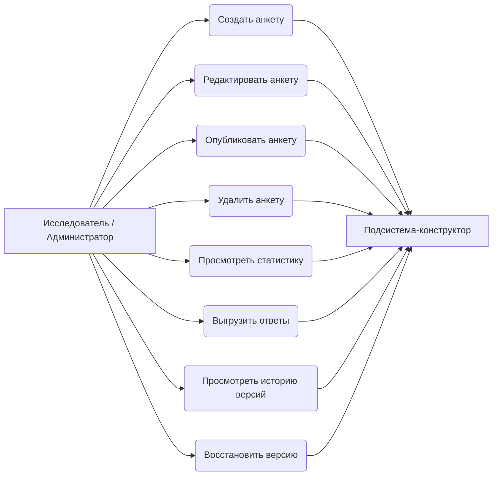
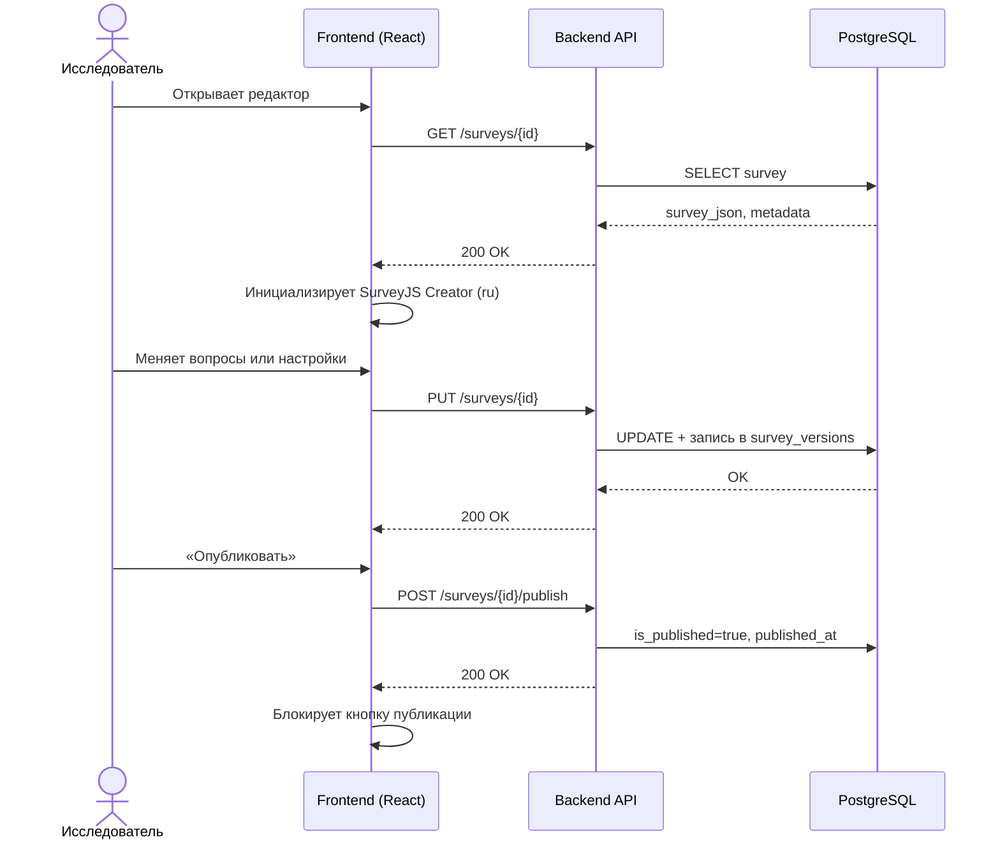
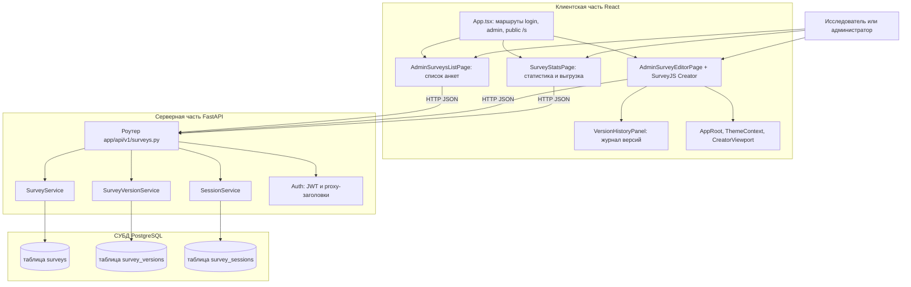

# Подсистема-конструктор анкетирования АСНИ социологических данных

*Фрагмент пояснительной записки к выпускной квалификационной работе (назначение, требования, диаграммы, описание интерфейса и программной реализации подсистемы).*

---

## 2. Подсистема-конструктор анкетирования

### 2.1. Назначение подсистемы и её место в архитектуре АСНИ

Подсистема-конструктор анкетирования входит в АСНИ социологических данных как модуль, в котором исследователь собирает электронную форму опроса без программирования, сохраняет машиночитаемое описание в базу и ведёт анкету от черновика до публикации.

Конструктор даёт визуальный редактор SurveyJS Creator (вкладки «Дизайн», «Логика», «Предпросмотр»), настройку сроков и лимитов проведения, публикацию и просмотр собранных ответов. Сбор ответов и экран прохождения для респондента — зона подсистемы проведения анкетирования; конструктор отвечает за метаданные, `survey_json`, признак публикации и журнал версий.

Границы: конструктор не выполняет статистический анализ уровня АРМ исследователя (корреляции, кросс-таблицы «на лету»), но показывает сводку по сессиям и выгрузку JSON/CSV по конкретной анкете.

---

### 2.2. Требования к подсистеме-конструктору

#### 2.2.1. Функциональные требования

Обозначения приоритетов: О — обязательное (Must), Ж — желательное (Should), В — возможное (Could).

Таблица 2.1 — Функциональные требования к подсистеме-конструктору анкетирования

| ID | Формулировка требования | Приоритет |
|----|-------------------------|-----------|
| К.1.01 | Пользователь с ролью `admin` или `researcher` создаёт анкету и открывает её в режиме редактирования | О |
| К.1.02 | Подсистема предоставляет визуальный редактор структуры анкеты (страницы, типы вопросов, свойства элементов) без написания кода | О |
| К.1.03 | Описание анкеты сохраняется в JSON по схеме SurveyJS, совместимой с исполнителем в подсистеме проведения | О |
| К.1.04 | Изменения черновика автоматически сохраняются на сервер с задержкой около 1 с (только для ролей с правом редактирования) | Ж |
| К.1.05 | Ручное сохранение черновика по команде пользователя | О |
| К.1.06 | При изменении отслеживаемых полей анкеты сервер увеличивает номер версии и пишет запись в журнал `survey_versions` | О |
| К.1.07 | Исследователь публикует анкету; после публикации она доступна подсистеме проведения по идентификатору | О |
| К.1.08 | Повторная публикация через интерфейс конструктора не предусмотрена (кнопка блокируется после первого успешного publish) | В |
| К.1.09 | Исследователь может удалить ненужную анкету (каскадно удаляются сессии) | Ж |
| К.1.10 | Настройка логики анкеты через вкладку «Логика» SurveyJS Creator; в интерфейсе есть справка по условному показу вопросов | Ж |
| К.1.11 | Настройка сроков проведения: дата/время начала и окончания приёма ответов | О |
| К.1.12 | Задание `max_responses`; при достижении лимита подсистема проведения не создаёт новые сессии | Ж |
| К.1.13 | Разрешение или запрет анонимного прохождения (`allow_anonymous`) | Ж |
| К.1.14 | Просмотр статистики анкеты: число сессий, завершённость, средний прогресс, распределение ответов по вопросам | О |
| К.1.15 | Выгрузка ответов в JSON или CSV (параметры `include_incomplete`, `anonymize` на уровне API) | Ж |
| К.1.16 | Просмотр журнала версий анкеты: автор, время, краткое описание изменений | О |
| К.1.17 | Восстановление выбранной версии из журнала (текущее состояние сохраняется как новая версия) | Ж |
| К.1.18 | В списке анкет отображается статус проведения: черновик, ещё не начато, активна, завершено | Ж |
| К.1.19 | Копирование публичной ссылки `/s/{id}` и открытие страницы прохождения в новой вкладке | Ж |

#### 2.2.2. Нефункциональные требования

Таблица 2.2 — Нефункциональные требования

| ID | Формулировка | Приоритет |
|----|----------------|-----------|
| К.2.01 | Создание, изменение, публикация, удаление и восстановление версий защищены JWT; роли `admin` и `researcher` имеют полный доступ к мутациям | О |
| К.2.02 | API описано в OpenAPI (Swagger); в продакшене предполагается HTTPS через обратный прокси | Ж |
| К.2.03 | `survey_json` и снимки версий хранятся в PostgreSQL как JSONB | О |
| К.2.04 | Автосохранение с интервалом ~1 с не блокирует интерфейс редактора | В |
| К.2.05 | Светлая и тёмная тема MUI и SurveyJS Creator; выбор темы сохраняется в `localStorage` (`theme_mode`) | В |
| К.2.06 | Русская локализация интерфейса SurveyJS Creator и форм | Ж |
| К.2.07 | Подсистема может подключаться к оболочке АСНИ как Module Federation remote (`surveyConstructor`) | В |
| К.2.08 | При `PROXY_AUTH_ENABLED=true` допускается аутентификация через заголовки `X-Forwarded-User` и `X-Forwarded-Role` от доверенного прокси | В |

---

### 2.3. Диаграмма прецедентов

Рисунок 2.1 — Диаграмма прецедентов подсистемы-конструктора

---

### 2.4. Диаграмма последовательности (создание, сохранение, публикация)

Рисунок 2.2 — Последовательность создания и публикации анкеты

---

### 2.5. Диаграмма компонентов

На рисунке 2.3 показано вертикальное разбиение: сверху клиент на React, ниже REST API на FastAPI, внизу PostgreSQL. Такой вид удобно экспортировать из редактора Mermaid (https://mermaid.live) в PNG и вставить в Word без поворота.

Рисунок 2.3 — Компоненты подсистемы-конструктора (вертикальная схема)

Ниже по слоям перечислены основные модули и то, за что каждый отвечает в работе конструктора.

Клиентская часть (React, каталог frontend/src).

App.tsx задаёт маршрутизацию SPA. Пользователь после входа попадает в /admin/surveys, открывает редактор по /admin/surveys/:id, статистику по /admin/surveys/:id/stats. Публичное прохождение анкеты идёт по /s/:surveyId в том же приложении, но верхняя административная панель на этих URL скрывается, чтобы респондент не видел чужие разделы.

AdminSurveysListPage.tsx рисует таблицу всех анкет. Для каждой строки видны заголовок, дата создания, опубликована ли анкета и статус проведения: черновик, ещё не начато, активна или завершено. Статус считается по полям start_date, starts_at, end_date, ends_at. На странице есть счётчики: сколько анкет всего и сколько сейчас в окне приёма ответов. Отсюда же вызываются создание новой анкеты, переход в редактор, копирование ссылки /s/{id}, открытие публичной страницы в новой вкладке, удаление. Роль student может только просматривать список без кнопок редактирования и статистики.

AdminSurveyEditorPage.tsx это основной экран конструктора. Внутри инициализируется SurveyJS Creator с русской локалью, вкладками дизайна, логики и предпросмотра. Редактор пишет результат в поле survey_json. Автосохранение с задержкой около одной секунды отправляет PUT /surveys/{id} только для ролей admin и researcher. Отдельно доступны ручное сохранение, однократная публикация, удаление анкеты, диалог сроков и лимитов (max_responses, allow_anonymous), встроенная справка по условному показу вопросов. Компоненты CreatorViewport и EditorChromeContext при прокрутке полотна Creator прячут верхнюю навигацию и панель инструментов, чтобы оставалось больше места под вопросы.

VersionHistoryPanel.tsx показывается справа от редактора в ResizableSplitPane. Панель запрашивает GET /surveys/{id}/versions, выводит список ревизий с автором, временем и кратким текстом изменений. По кнопке восстановления вызывается POST /surveys/{id}/versions/{version_id}/restore; после ответа сервера в Creator подставляется сохранённый снимок survey_json. Свёрнутость панели запоминается в localStorage.

SurveyStatsPage.tsx загружает анкету, агрегаты GET /surveys/{id}/stats и список сессий GET /surveys/{id}/sessions. На экране карточки с числом сессий, долей завершённых, средним прогрессом, полоса завершённости, распределение ответов по вопросам и таблица сессий с возможностью показать все строки. Ссылки ведут на экспорт CSV или JSON через /api/v1/surveys/{id}/export.

AppRoot.tsx и ThemeContext.tsx подключают MUI ThemeProvider, BrowserRouter и режим светлой или тёмной темы. Выбор хранится в localStorage под ключом theme_mode. Файлы theme.ts и surveyCreatorTheme.ts задают цвета интерфейса, в том числе primary #003399.

Модуль api.ts на axios собирает все вызовы к backend: токен Bearer из localStorage, при ответе 401 очистка авторизации и переход на /login. Типы Survey, SurveyVersion, Session описывают поля, которые ждёт UI.

Серверная часть (FastAPI, каталог backend/app).

Роутер surveys.py принимает HTTP-запросы от браузера. Создание, изменение, публикация, удаление и восстановление версии проходят через зависимость has_role(admin): на практике доступ есть у admin и researcher. Чтение списка, одной анкеты, статистики и журнала версий открыто любому активному пользователю с валидным JWT.

SurveyService инкапсулирует работу с таблицей surveys: CRUD, publish, расчёт статистики по сессиям, проверку доступности анкеты для публичного API, подсчёт завершённых ответов для лимита max_responses. При update сравниваются старые и новые значения полей, увеличивается счётчик version, в журнал пишется запись через SurveyVersionService.

SurveyVersionService обслуживает таблицу survey_versions. На создание, правку, публикацию и restore сохраняется снимок survey_json и структура changes из модуля survey_diff.py. Если журнал пуст при первом запросе списка версий, создаётся начальная запись о создании анкеты.

SessionService нужен конструктору для списка сессий на странице статистики и для выгрузки ответов. Сами сессии создаёт подсистема проведения через public API, но данные лежат в той же базе.

Модуль auth.py выдаёт JWT по логину и паролю, проверяет Bearer в защищённых маршрутах. При PROXY_AUTH_ENABLED=true допускается вход по заголовкам X-Forwarded-User и X-Forwarded-Role от доверенного прокси оболочки АСНИ.

Слой данных.

PostgreSQL хранит surveys (метаданные и survey_json в JSONB), survey_versions (история правок) и survey_sessions (ответы респондентов). Миграции Alembic поднимаются при старте контейнера survey-api. Связь survey_id в сессиях и версиях настроена с ON DELETE CASCADE: при удалении анкеты исчезают и её сессии, и история версий.

Обмен между слоями идёт по REST в формате JSON. В production браузер обращается к nginx контейнера survey-frontend, тот проксирует /api на survey-api. В режиме разработки Vite на порту 5173 проксирует /api на localhost:8001. Тот же фронтенд может отдаваться как Module Federation remote surveyConstructor для встраивания в shell АСНИ.

---

### 2.6. Описание программной реализации

#### 2.6.1. Клиентский модуль (`frontend/`)

**Маршрутизация и оболочка.** `App.tsx` задаёт маршруты `/login`, `/admin/surveys`, `/admin/surveys/:id`, `/admin/surveys/:id/stats`; на публичных путях `/s/*` верхняя панель администратора скрыта. `AppRoot.tsx` подключает `BrowserRouter`, MUI `ThemeProvider`, `EditorChromeProvider` и читает `theme_mode` из `localStorage`.

**Список анкет** (`AdminSurveysListPage.tsx`). Таблица с заголовком, датой создания, статусом публикации и статусом проведения (черновик / ещё не начато / активна / завершено — по `start_date`, `starts_at`, `end_date`, `ends_at`). Карточки-счётчики: всего анкет и сколько сейчас «активны». Действия: создать (`POST /surveys` с пустым `survey_json`), редактировать, статистика, копировать ссылку `/s/{id}`, открыть публичную страницу, удалить. Роль `student` видит список, но не получает кнопок редактирования и статистики.

**Редактор** (`AdminSurveyEditorPage.tsx`). SurveyJS Creator с русской локалью, вкладкой логики и автосохранением (`autoSaveEnabled`, задержка 1 с) для `admin`/`researcher`. Отдельные кнопки: сохранить вручную, опубликовать (один раз), удалить, настройки проведения, справка по условной логике, переход к статистике. Диалог настроек записывает `start_date`, `end_date`, `starts_at`, `ends_at`, `max_responses`, `allow_anonymous` (в UI даты дублируются в обе пары полей для совместимости с API проведения). Справа — панель истории версий (`VersionHistoryPanel`) в `ResizableSplitPane`; состояние свёрнутости панели хранится в `localStorage`. При прокрутке области Creator верхняя навигация и панель инструментов Creator скрываются (`CreatorViewport`, `EditorChromeContext`).

**История версий** (`VersionHistoryPanel.tsx`). Загрузка `GET /surveys/{id}/versions`, раскрытие деталей изменений, восстановление через `POST .../versions/{version_id}/restore` с подтверждением. После restore редактор подставляет `survey_json` из ответа.

**Статистика** (`SurveyStatsPage.tsx`). Параллельно запрашивает анкету, `GET /stats` и `GET /sessions`. Карточки: всего сессий, завершено, в процессе, доля завершения, средний прогресс; полоса завершённости; горизонтальные диаграммы по вопросам; таблица сессий (первые 10 строк, кнопка «показать все»). Экспорт: ссылки на `/api/v1/surveys/{id}/export?format=csv|json&include_incomplete=true` (флаг `anonymize` в UI не вынесен, но API его поддерживает).

**API-клиент** (`api.ts`). Axios, таймаут 30 с, Bearer из `localStorage`, при 401 — очистка токена и редирект на `/login`. Типизированные вызовы для surveys, versions, auth.

**Тема и Creator** (`theme.ts`, `surveyCreatorTheme.ts`, `survey-creator-overrides.css`). Палитра ННГУ (primary `#003399`), шрифт Inter.

**Интеграция с АСНИ.** `vite.config.ts` собирает remote `surveyConstructor` с экспортом `./App` и `./api` (`@originjs/vite-plugin-federation`), общие singleton: `react`, `react-dom`, `react-router-dom`, `axios`.

#### 2.6.2. Серверный модуль (`backend/`)

**Маршруты анкет** (`app/api/v1/surveys.py`):

| Метод | Путь | Кто вызывает | Назначение |
|-------|------|--------------|------------|
| `POST` | `/surveys` | `admin`/`researcher`* | Создание |
| `GET` | `/surveys` | любой авторизованный | Список |
| `GET` | `/surveys/{id}` | любой авторизованный | Чтение |
| `PUT` | `/surveys/{id}` | `admin`/`researcher`* | Частичное обновление + версия |
| `POST` | `/surveys/{id}/publish` | `admin`/`researcher`* | Публикация |
| `DELETE` | `/surveys/{id}` | `admin`/`researcher`* | Удаление |
| `GET` | `/surveys/{id}/versions` | любой авторизованный | Журнал версий |
| `GET` | `/surveys/{id}/versions/{vid}` | любой авторизованный | Детали версии |
| `POST` | `/surveys/{id}/versions/{vid}/restore` | `admin`/`researcher`* | Восстановление |
| `GET` | `/surveys/{id}/stats` | любой авторизованный | Агрегаты |
| `GET` | `/surveys/{id}/sessions` | любой авторизованный | Список сессий |
| `GET` | `/surveys/{id}/export` | `admin`/`researcher`* | JSON/CSV |
| `GET` | `/surveys/{id}/responses` | `admin`/`researcher`* | Legacy: только завершённые |

\*Зависимость `has_role("admin")` в коде пропускает и роль `researcher` (`app/core/auth.py`).

**Сервис анкет** (`survey_service.py`). CRUD, `publish_survey`, `get_stats` (счётчики сессий, `completion_rate`, `avg_progress_pct`, распределения по вопросам с учётом множественного выбора), `get_public_survey` для проведения, `completed_response_count` для лимита ответов.

**Сервис версий** (`survey_version_service.py`, `utils/survey_diff.py`). На create/update/publish/restore пишется строка в `survey_versions` с `version_number`, `edited_by_name`, `change_summary`, структурой `changes` (diff полей и структуры `survey_json`), `survey_json_snapshot`. Восстановление поднимает снимок в текущую анкету и создаёт новую запись журнала. Если журнал пуст при первом `GET /versions`, создаётся синтетическая запись «создана».

**Модель `surveys`** (`models/survey.py`): `title`, `description`, `survey_json` (JSONB), `is_published`, `version`, `published_at`, `start_date`, `end_date`, `starts_at`, `ends_at`, `max_responses`, `allow_anonymous`, метки времени.

**Модель `survey_versions`** (миграция `0007_survey_versions.py`): FK на `surveys` с `ON DELETE CASCADE`, поля снимка и diff.

**Аутентификация** (`auth.py`). `POST /auth/token`, `GET /auth/me`, `POST /auth/register` (если `REGISTRATION_OPEN=true`; UI регистрации нет). JWT в claim `sub` и `role`.

**Служебные точки** (`main.py`): `GET /healthz`, `GET /api/v1/info` (метаданные подсистемы и возможностей).

#### 2.6.3. Развёртывание

`docker-compose.yml` поднимает три сервиса:

1. **`survey-db`** — `postgres:16`, том `survey_pgdata`, healthcheck `pg_isready`, порт хоста `5433`.
2. **`survey-api`** — образ из `backend/Dockerfile` (`python:3.11-slim`), `entrypoint.sh`: ожидание БД → `alembic upgrade head` → `uvicorn`, порт хоста `8001`.
3. **`survey-frontend`** — образ из `frontend/Dockerfile`: сборка Vite → nginx на порту `80`, проксирование `/api` на `survey-api`.

Для разработки UI часто запускают отдельно: `cd frontend && npm run dev` (порт `5173`, прокси `/api` → `8001`). CI (GitHub Actions) поднимает compose и гоняет E2E против `http://localhost:80`.

#### 2.6.4. E2E-тестирование

На каждый push/PR в CI поднимается стек, затем четыре скрипта на `urllib` без внешних зависимостей:

| Скрипт | Что проверяет |
|--------|----------------|
| `e2e_smoke.py` | Регистрация, CRUD, publish, автосохранение, публичное прохождение |
| `e2e_survey_lifecycle.py` | Полный цикл create → update → publish → delete |
| `e2e_public_flow.py` | Сессия, два autosave, complete |
| `e2e_stats_and_export.py` | `/stats`, экспорт JSON/CSV, `anonymize` |

Отдельного E2E на восстановление версии пока нет.

---

### 2.7. Взаимодействие с другими подсистемами АСНИ

- **Хранение данных** — PostgreSQL; `survey_json` и снимки версий в JSONB.
- **Проведение анкетирования** — после publish анкета читается через `GET /api/v1/public/surveys/{id}`; исполнение логики на клиенте SurveyJS. Параметры `starts_at`, `ends_at`, `start_date`, `end_date`, `max_responses`, `allow_anonymous` проверяются при старте и сохранении сессии.
- **Оболочка АСНИ** — загрузка remote `surveyConstructor` или proxy-auth от родительского приложения.

---

### 2.8. Ограничения и допущения текущей версии (MVP)

Одновременное редактирование одной анкеты несколькими пользователями не блокируется: последняя запись перезаписывает предыдущую. Повторная публикация через UI отключена. В журнале версий хранятся снимки и diff, но нет построчного merge двух веток редактирования. Роль `student` только просматривает список. Регистрация пользователей — через API, без формы в интерфейсе. Флаг `anonymize` при выгрузке доступен в API, но не на странице статистики.

---

*Конец фрагмента. Номера рисунков и таблиц при вставке в пояснительную записку привести к сквозной нумерации документа. Диаграммы Mermaid можно экспортировать на https://mermaid.live.*
