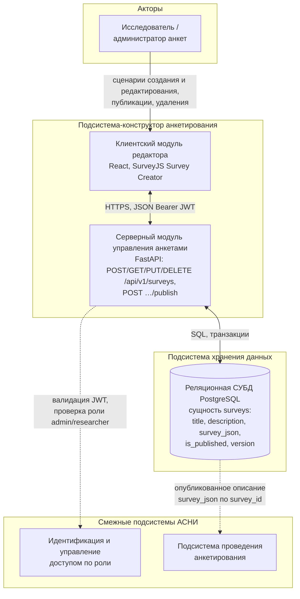

# Подсистема-конструктор анкетирования АСНИ социологических данных

*Фрагмент пояснительной записки к выпускной квалификационной работе (назначение, требования, диаграмма, описание интерфейса и программной реализации подсистемы).*

---

## 2. Подсистема-конструктор анкетирования

### 2.1. Назначение подсистемы и её место в архитектуре АСНИ

Подсистема-конструктор анкетирования входит в АСНИ социологических данных как модуль, который позволяет исследователю спроектировать электронную форму опроса без написания кода, сохранить машиночитаемое описание анкеты в базу данных и провести анкету через весь жизненный цикл — от черновика до публикации.

Конструктор реализует визуальное составление анкеты (no-code сценарий через редактор SurveyJS), а также настройку логики: ветвление, условия отображения элементов. Персонализация доступа респондентов и возможность приостановить и продолжить заполнение относятся к подсистеме проведения анкетирования; конструктор отвечает только за корректное описание структуры и логики, которые затем используются при прохождении опроса.

Границы ответственности: конструктор не занимается сбором ответов и статистическим анализом. Он формирует и версионирует метаданные анкеты (`survey_json`) и признак публикации — всё, что нужно подсистемам хранения данных и проведения опроса.

---

### 2.2. Требования к подсистеме-конструктору

#### 2.2.1. Функциональные требования

Обозначения приоритетов: О — обязательное (Must), Ж — желательное (Should), В — возможное (Could).

Таблица 2.1 — Функциональные требования к подсистеме-конструктору анкетирования

| ID | Формулировка требования | Приоритет |
|----|-------------------------|-----------|
| К.1.01 | Пользователь с правами исследователя или администратора создаёт новую анкету и открывает её в режиме редактирования | О |
| К.1.02 | Подсистема предоставляет визуальный редактор структуры анкеты (страницы, типы вопросов, свойства элементов) без написания программного кода | О |
| К.1.03 | Описание анкеты сохраняется в виде JSON-документа по схеме SurveyJS, совместимого с исполнителем анкеты в подсистеме проведения опроса | О |
| К.1.04 | Изменения черновика автоматически сохраняются на сервер; операция доступна только ролям исследователя и администратора | Ж |
| К.1.05 | Ручное сохранение черновика по команде пользователя | О |
| К.1.06 | При изменении JSON-описания анкеты сервер увеличивает номер версии | О |
| К.1.07 | Исследователь публикует анкету; после публикации анкета доступна подсистеме проведения анкетирования по идентификатору | О |
| К.1.08 | После первого успешного опубликования повторная публикация через интерфейс конструктора не требуется (кнопка блокируется) | В |
| К.1.09 | Исследователь может удалить анкету, которая больше не нужна | Ж |
| К.1.10 | Подсистема поддерживает настройку логики анкеты через вкладку логики редактора SurveyJS Creator | Ж |

#### 2.2.2. Нефункциональные требования

Таблица 2.2 — Нефункциональные требования

| ID | Формулировка | Приоритет |
|----|----------------|-----------|
| К.2.01 | Доступ к созданию, изменению, публикации и удалению анкеты защищён аутентификацией и авторизацией по роли | О |
| К.2.02 | Обмен данными между браузером и сервером идёт по HTTPS; API документируется в формате OpenAPI (Swagger) | Ж |
| К.2.03 | Описание анкеты хранится в СУБД в полуструктурированном виде (JSON/JSONB) — это даёт гибкость схемы вопросов | О |
| К.2.04 | Операции сохранения выполняются с задержкой порядка 1 с, что позволяет использовать автосохранение без потери работоспособности интерфейса | В |

#### 2.2.3. Пользовательские сценарии

Сценарий A — создание и редактирование черновика. Пользователь переходит к списку анкет и создаёт новую запись; система перенаправляет его в редактор. Загружается сохранённое описание или начальная структура. Пользователь меняет страницы и вопросы в визуальном конструкторе, изменения сохраняются на сервер (автоматически или по кнопке «Сохранить»). На экране видны идентификатор анкеты, статус (черновик/опубликовано) и номер версии.

Сценарий B — подготовка к проведению опроса. Когда методическая настройка завершена, пользователь публикует анкету: на сервер уходит актуальное JSON-описание, выставляется признак публикации. Дальше анкету проходят респонденты — уже в подсистеме проведения анкетирования.

Сценарий C — исключение анкеты. Пользователь удаляет ненужную анкету; запись удаляется из базы данных с учётом каскадных связей.

---

### 2.3. Структурная диаграмма подсистемы

Рисунок 2.1 — Структурная диаграмма подсистемы-конструктора анкетирования

На диаграмме подсистема-конструктор показана как два модуля: клиентский и серверный. Исследователь (или администратор) работает с клиентским модулем редактора — визуальное проектирование анкеты выполняется через SurveyJS Survey Creator, результат сохраняется как документ `survey_json`.

Клиентский модуль обращается к серверному модулю (REST API на FastAPI) по HTTPS. В запросах передаётся JSON-представление анкеты и токен доступа JWT. На сервере проверяется подлинность пользователя и его роль (на диаграмме контур идентификации обозначен пунктиром).

Серверный модуль выполняет CRUD-операции над записями анкеты и операцию публикации. При изменении JSON-описания обновляется версия. Данные хранятся в PostgreSQL: таблица `surveys`, поле `survey_json` типа JSONB содержит описание структуры и логики анкеты, которое читает исполнитель SurveyJS.

Подсистема проведения анкетирования не входит в конструктор. Она получает опубликованное описание (`survey_json`) по идентификатору анкеты, когда респондент проходит опрос.

---

### 2.4. Выбор средств разработки подсистемы

Подсистема построена по схеме «клиент — сервер — база данных». На клиенте используется TypeScript, на сервере — Python 3, хранение — PostgreSQL.

Клиентская часть. Для SPA рассматривались React, Vue.js и Angular. В пользу React сыграла официальная поддержка SurveyJS Creator именно для этого фреймворка (пакет `survey-creator-react`). Сборка и локальный сервер разработки — Vite. Компоновка экранов — Material UI. Запросы к серверу отправляются через Axios (JSON, заголовок JWT).

Серверная часть. Для REST API на Python рассматривались FastAPI и Django REST Framework. Выбран FastAPI: асинхронная работа из коробки, автоматическая генерация OpenAPI-документации, удобный механизм зависимостей (`Depends`). Доступ к данным — SQLAlchemy 2.x (async). Валидация — Pydantic. Аутентификация — JWT (`python-jose`), хеширование паролей — passlib (PBKDF2).

Таблица 2.3 — Стек подсистемы-конструктора

| Уровень | Технология | Назначение в подсистеме |
|--------|------------|-------------------------|
| UI | React, TypeScript, Vite | SPA: список анкет, вход, редактор Survey Creator |
| UI-домен | SurveyJS Creator | Визуальное проектирование `survey_json` |
| Транспорт | HTTPS, JSON, Axios | Вызовы `/api/v1/...` |
| API | FastAPI, Uvicorn | Маршруты анкет, публикация, проверка ролей |
| Данные | PostgreSQL, JSONB | Таблица `surveys`, поле `survey_json` |
| Контейнеризация | Docker Compose | Сервисы API и СУБД, миграции при старте |

Сравнение SPA-фреймворков (обобщённо):

| Критерий | React | Vue.js | Angular |
|----------|--------|--------|---------|
| Интеграция с SurveyJS Creator | Официальные пакеты | Поддержка есть | Возможна, избыточна для MVP |
| Экосистема UI-компонентов | Material UI и др. | Element Plus, Vuetify и др. | Material для Angular и др. |

По совокупности факторов для клиента выбран React, для сервера — FastAPI + SQLAlchemy + PostgreSQL.

---

### 2.5. Проектирование состава подсистемы

Логически подсистема разбита на следующие части:

1. Модуль пользовательского интерфейса — страницы React: вход (`LoginPage`), список анкет (`AdminSurveysListPage`), редактор (`AdminSurveyEditorPage` с `SurveyCreatorComponent`). Общая оболочка — `App.tsx` (маршрутизация, панель, выход).

2. Модуль клиентского доступа к API — `frontend/src/api.ts`: единый экземпляр Axios, токен, функции для работы с анкетами и аутентификацией.

3. Модуль REST API управления анкетами — FastAPI, префикс `/api/v1/surveys`.

4. Модуль авторизации — `/api/v1/auth/*`, зависимость `has_role` для операций изменения анкеты.

5. Модуль хранения — сущность Survey, таблица `surveys`, поле `survey_json` (JSONB).

6. Модуль развёртывания — Docker Compose, PostgreSQL, контейнер API, Alembic при старте.

Информационное обеспечение (логический уровень):

| Сущность | Назначение полей |
|----------|------------------|
| Анкета (Survey) | Уникальный идентификатор; заголовок и описание; `survey_json` — структура анкеты для SurveyJS; признак публикации; целочисленная версия (увеличивается при изменении JSON-описания) |

Экраны SPA (маршруты):

- `/` — перенаправление на `/admin/surveys`.
- `/login` — вход, выбор роли (администратор / исследователь / студент), поля учётной записи.
- `/admin/surveys` — таблица анкет, создание, переход к редактору, удаление (при наличии прав).
- `/admin/surveys/:id` — редактор Survey Creator: сохранение, публикация, удаление, отображение id, статуса draft/published, версии.

Публичный маршрут `/s/:surveyId` относится к подсистеме проведения анкетирования, не к конструктору.

---

### 2.6. Программная реализация подсистемы

#### 2.6.1. Клиентское приложение (`frontend/`)

`main.tsx` — точка входа. Здесь подключаются стили SurveyJS, создаётся корневой React-компонент и оборачивается в `BrowserRouter`. В production-режиме дополнительно регистрируется сервис-воркер для работы в режиме PWA.

`App.tsx` — корневой компонент приложения. Хранит роль текущего пользователя в состоянии и в `localStorage`. При открытии страницы, если токен есть, а роль не определена, компонент запрашивает профиль пользователя через `getCurrentUser()`. Также здесь объявлены маршруты:

- `/login` — страница входа;
- `/admin/surveys` и `/admin/surveys/:id` — защищённые страницы, без авторизации перенаправляют на `/login`;
- `/s/:surveyId` — публичное прохождение анкеты (смежная подсистема);
- `/` — перенаправление на список анкет.

`api.ts` — все запросы к серверу. Создаётся один экземпляр Axios с базовым URL из переменной окружения `VITE_API_BASE_URL` (или `/api/v1` по умолчанию). Токен хранится в заголовке и в `localStorage` и восстанавливается при перезагрузке страницы. Основные функции:

- `login` — POST `/auth/token`, тело в формате form-urlencoded;
- `getCurrentUser` — GET `/auth/me`;
- `getSurveys`, `getSurvey`, `createSurvey`, `updateSurvey`, `deleteSurvey`, `publishSurvey` — CRUD-операции с анкетами;
- `getPublicSurvey`, `startSession`, `saveProgress`, `completeSession` — функции для прохождения опроса (смежная подсистема).

`pages/LoginPage.tsx` — страница входа. Пользователь выбирает роль (admin / researcher / student), вводит логин и пароль. При нажатии «Войти» вызывается `handleLogin`: получает токен, запрашивает профиль, сверяет роль с выбранной на форме. Если роли не совпадают — токен сбрасывается и выводится ошибка.

`pages/AdminSurveysListPage.tsx` — список анкет. При загрузке страницы вызываются `getSurveys()` и `getCurrentUser()`. Кнопки «Создать» и «Удалить» доступны только ролям admin и researcher. `handleCreate` создаёт черновую анкету с одной пустой страницей и переходит в редактор. `handleDelete` запрашивает подтверждение и удаляет запись.

`pages/AdminSurveyEditorPage.tsx` — редактор анкеты. Экземпляр `SurveyCreator` создаётся один раз через `useMemo` с включённой вкладкой логики и автосохранением с задержкой 1000 мс. При открытии страницы загружается существующая анкета и её JSON передаётся в `creator.JSON`. Основные обработчики:

- `saveSurveyFunc` — вызывается автосохранением Survey Creator; отправляет `updateSurvey` или `createSurvey` в зависимости от того, есть ли у анкеты id;
- `handleSave` — ручное сохранение по кнопке;
- `handlePublish` — сначала сохраняет анкету, затем вызывает `publishSurvey`; кнопка блокируется после публикации;
- `handleDelete` — удаляет анкету и возвращает к списку.

Автосохранение включается только для ролей admin и researcher. Состояние редактора (`saving` / `saved` / `modified`) опрашивается каждые 300 мс и отображается рядом с кнопкой «Сохранить».

`pages/PublicSurveyRunPage.tsx` — страница прохождения опроса. В конструктор анкет не входит, относится к смежной подсистеме. Загружает опубликованную анкету, создаёт или восстанавливает сессию, сохраняет ответы и фиксирует завершение по событию `onComplete`.

#### 2.6.2. Серверное приложение (`backend/`)

`app/main.py` — создаётся приложение FastAPI, настраивается CORS, подключается роутер с префиксом `/api/v1`. При старте вызывается `init_db()`. Маршрут GET `/healthz` используется для проверки доступности сервиса.

`app/api/v1/router.py` — подключает три роутера: `surveys`, `public`, `auth`. Итоговые пути: `/api/v1/surveys/...`, `/api/v1/public/...`, `/api/v1/auth/...`.

`app/core/db.py` — асинхронный движок SQLAlchemy, фабрика сессий `SessionLocal`. Генератор `get_db` открывает сессию на время запроса и передаётся как зависимость FastAPI. Схема базы накатывается через Alembic, а не в коде.

`app/core/auth.py` — вся логика аутентификации и авторизации:

- `verify_password`, `get_password_hash` — работа с паролями через Passlib (схема `pbkdf2_sha256`);
- `authenticate_user` — проверяет пароль и флаг активности пользователя;
- `create_access_token` — создаёт JWT с алгоритмом HS256 и сроком из настроек;
- `get_current_user` — декодирует токен, загружает пользователя из БД;
- `has_role` — фабрика зависимостей; пропускает запрос, если роль пользователя совпадает с нужной или пользователь является admin/researcher.

`app/api/v1/auth.py` — маршруты аутентификации:

- POST `/auth/token` — выдаёт токен по логину и паролю;
- GET `/auth/me` — возвращает профиль текущего пользователя;
- POST `/auth/register` — регистрация нового пользователя; при дублировании имени возвращает ошибку 400.

`app/api/v1/surveys.py` — маршруты управления анкетами (`/api/v1/surveys`):

- POST `/` — создаёт анкету (`is_published=False`, `version=1`); требует роль admin/researcher;
- GET `/` — возвращает список всех анкет; JWT не требуется;
- GET `/{id}` — возвращает одну анкету по UUID; JWT не требуется;
- PUT `/{id}` — обновляет анкету; при изменении `survey_json` счётчик `version` увеличивается на 1;
- POST `/{id}/publish` — выставляет `is_published=True`;
- DELETE `/{id}` — удаляет анкету, ответ 204;
- GET `/{id}/responses` — JSON-список завершённых ответов;
- GET `/{id}/export` — выгрузка ответов в JSON или CSV; параметр `anonymize` обнуляет id респондента.

`app/api/v1/public.py` — публичные маршруты для прохождения анкеты. Анкета отдаётся только если опубликована. Поддерживаются создание и восстановление сессии, сохранение промежуточных ответов, завершение сессии.

`app/models/survey.py` — ORM-модель таблицы `surveys`: поля `title`, `description`, `survey_json` (JSONB), `is_published`, `version`.

`app/schemas/survey.py` — Pydantic-схемы: `SurveyCreate`, `SurveyUpdate` (все поля опциональны), `SurveyOut`.

`entrypoint.sh` — скрипт запуска контейнера: ждёт готовности PostgreSQL, применяет миграции (`alembic upgrade head`), запускает `uvicorn` на порту 8000.

#### 2.6.3. Развёртывание

Приложение запускается через Docker Compose. Файл `docker-compose.yml` описывает два сервиса: базу данных и API.

Сервис `survey-db`:

- образ `postgres:16`;
- база данных `survey_db`, пользователь `survey`;
- данные хранятся в именованном томе `survey_pgdata`, поэтому при перезапуске контейнера не теряются;
- для проверки готовности настроен healthcheck: `pg_isready -U survey -d survey_db` с интервалом 5 секунд;
- порт 5432 внутри контейнера проброшен на 5433 хоста, чтобы не конфликтовать с локальным PostgreSQL.

Сервис `survey-api`:

- собирается из `backend/Dockerfile`: базовый образ `python:3.11-slim`, устанавливается `postgresql-client` для работы `pg_isready` в скрипте запуска, далее устанавливаются зависимости из `requirements.txt`, копируются исходники, `alembic.ini` и `alembic/`, скрипт `entrypoint.sh`;
- переменные окружения берутся из файла `backend/.env`: строка подключения к БД (`DATABASE_URL`), список разрешённых источников CORS (`CORS_ORIGINS`), флаг отладки (`DEBUG`);
- сервис запускается только после того, как `survey-db` прошёл healthcheck (`condition: service_healthy`);
- при сбое контейнер перезапускается (`restart: on-failure`);
- порт 8000 внутри контейнера проброшен на 8001 хоста.

При старте контейнера выполняется `entrypoint.sh`:

1. цикл ожидания PostgreSQL через `pg_isready`;
2. применение миграций: `alembic upgrade head`;
3. запуск сервера: `uvicorn app.main:app --host 0.0.0.0 --port 8000`.

Такая схема позволяет поднять всё окружение одной командой `docker compose up` без предварительной ручной настройки базы данных.

---

### 2.7. Взаимодействие с другими подсистемами АСНИ

- Подсистема хранения данных — конструктор читает и записывает данные в PostgreSQL; `survey_json` хранится как JSONB.
- Подсистема проведения анкетирования — после публикации получает анкету по публичному API (`/api/v1/public/surveys/{id}`); логика исполняется на клиенте SurveyJS по сохранённому `survey_json`.
- Идентификация и доступ — JWT и роли пользователей для административных операций.

---

### 2.8. Ограничения и допущения текущей версии (MVP)

Одновременное редактирование одной анкеты несколькими пользователями не поддерживается — механизм блокировок не реализован. Полная история правок JSON не ведётся, хранится только скалярный счётчик `version`. Набор типов вопросов определяется возможностями SurveyJS. Описание анкеты на сервере ограничено полями, которые принимает API.

---

*Конец фрагмента. Номера рисунков и таблиц при вставке в пояснительную записку привести к сквозной нумерации документа. Диаграмму Mermaid можно экспортировать в PNG/SVG на https://mermaid.live для включения в PDF.*
