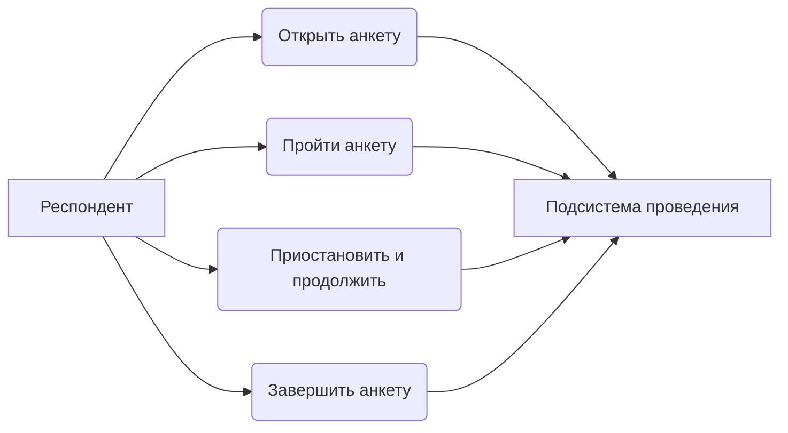

# Подсистема проведения анкетирования АСНИ социологических данных

*Фрагмент пояснительной записки к выпускной квалификационной работе (назначение, требования, диаграмма, описание интерфейса и программной реализации подсистемы).*

---

## 3. Подсистема проведения анкетирования

### 3.1. Назначение подсистемы и её место в архитектуре АСНИ

Подсистема проведения анкетирования отвечает за то, что происходит после того, как исследователь опубликовал анкету в конструкторе. Она загружает опубликованную анкету по идентификатору, предоставляет респонденту интерактивный интерфейс прохождения, сохраняет промежуточные ответы и фиксирует факт завершения.

Подсистема не занимается созданием и редактированием анкет — это зона ответственности конструктора. Также статистический анализ собранных ответов относится к АРМ исследователя. Граница чёткая: подсистема получает готовый `survey_json` и сессию, всё остальное выходит за её рамки.

Из требований на рисунке 3.1 (схема АСНИ) реализованы следующие функции:

- интерактивное прохождение анкеты с динамической адаптацией на основе логики, заложенной в `survey_json`;
- возможность приостановить заполнение и продолжить позже (сессионная модель);
- промежуточное хранение ответов до момента завершения;
- отслеживание прогресса респондента (процент заполненных вопросов) с сохранением на сервере;
- восстановление позиции (номера страницы) при продолжении сессии;
- проверка лимита ответов (`max_responses`) и блокировка новых сессий при его достижении;
- требование идентификатора респондента, если анонимное прохождение запрещено (`allow_anonymous=False`);
- проверка сроков проведения анкеты при каждом сохранении прогресса.

Персонализация доступа реализована через поле `respondent_id`: перед началом прохождения респондент может ввести своё имя или другой идентификатор, который сохраняется вместе с сессией. Поле необязательное, если анкета разрешает анонимное прохождение.

---

### 3.2. Требования к подсистеме проведения анкетирования

#### 3.2.1. Функциональные требования

Обозначения приоритетов: О — обязательное (Must), Ж — желательное (Should), В — возможное (Could).

Таблица 3.1 — Функциональные требования к подсистеме проведения анкетирования

| ID | Формулировка требования | Приоритет |
|----|-------------------------|-----------|
| П.1.01 | Респондент открывает анкету по публичной ссылке вида `/s/{survey_id}`; анкета отображается только если опубликована | О |
| П.1.02 | При открытии анкеты создаётся сессия прохождения и её идентификатор сохраняется в браузере | О |
| П.1.03 | Если в браузере уже есть идентификатор сессии для этой анкеты, подсистема восстанавливает ранее введённые ответы | О |
| П.1.04 | Ответы автоматически сохраняются на сервер при изменении значения любого вопроса и при переходе между страницами | Ж |
| П.1.05 | По завершении анкеты ответы фиксируются на сервере и сессия помечается как завершённая | О |
| П.1.06 | Динамическая логика анкеты (ветвление, условия показа вопросов) исполняется на стороне клиента средствами SurveyJS | О |
| П.1.07 | Завершённая сессия доступна исследователю для выгрузки через административный API | Ж |
| П.1.08 | Подсистема отслеживает прогресс респондента (процент заполненных вопросов) и сохраняет его на сервере при каждом изменении ответа | Ж |
| П.1.09 | Подсистема сохраняет номер текущей страницы анкеты для восстановления позиции при продолжении сессии | Ж |
| П.1.10 | При достижении лимита max_responses подсистема блокирует создание новых сессий и сообщает респонденту об этом | О |
| П.1.11 | Если анкета требует идентификации (allow_anonymous=False), подсистема не позволяет начать сессию без указания respondent_id | О |
| П.1.12 | Подсистема проверяет сроки проведения анкеты при каждом сохранении прогресса и блокирует сохранение по истечении срока | Ж |

#### 3.2.2. Нефункциональные требования

Таблица 3.2 — Нефункциональные требования

| ID | Формулировка | Приоритет |
|----|----------------|-----------|
| П.2.01 | Публичные маршруты прохождения не требуют авторизации (открытый доступ) | О |
| П.2.02 | Все операции сохранения идут по HTTPS | Ж |
| П.2.03 | Время отклика интерфейса прохождения не превышает 1 с при нормальной сети | В |
| П.2.04 | Автосохранение ответов выполняется с дебаунсом 700 мс для снижения нагрузки на сервер | В |
| П.2.05 | Интерфейс поддерживает тёмную и светлую тему с сохранением предпочтения в localStorage | В |

---

### 3.3. Диаграмма прецедентов

Рисунок 3.1 — Диаграмма прецедентов подсистемы проведения

---

### 3.4. Описание программной реализации

#### 3.4.1. Клиентский модуль (`frontend/`)

`PublicSurveyRunPage.tsx` — страница прохождения анкеты для респондентов. Получает `surveyId` из URL (`/s/{surveyId}`), загружает опубликованную анкету через `GET /public/surveys/{survey_id}`. Сессия управляется через `localStorage` (`survey_session_{surveyId}`). При наличии сохранённого session ID восстанавливает ответы и позицию; при отсутствии создаёт новую сессию через `POST /public/surveys/{survey_id}/sessions`.

Прогресс отслеживается локально через React state `progress` и обновляется при каждом изменении ответа или переходе страницы. Формула: процент заполненных видимых вопросов от общего числа видимых вопросов. Отображается в виде `LinearProgress` над анкетой.

Автосохранение реализовано через `scheduleSave(sessionId)` с дебаунсом 700 мс (`window.setTimeout`). Отправляет `PUT /public/sessions/{id}` с `answers_json`, `current_page` и `progress_pct`. Ошибки при автосохранении отображаются респонденту через уведомление Alert.

Состояния прохождения:
- `identify` — страница ввода идентификатора респондента. Если `allow_anonymous=False`, поле обязательно.
- `running` — активное прохождение. SurveyJS Runner рендерит анкету по `survey_json`. Хуки `onValueChanged` и `onCurrentPageChanged` вызывают `scheduleSave()`. `onComplete` отправляет `POST /public/sessions/{id}/complete` с финальными ответами и переводит страницу в `done`.
- `done` — страница с подтверждением завершения, именем участника (если было указано) и кнопкой «Пройти заново». `handleRestart()` удаляет ключ из `localStorage`, сбрасывает состояние и возвращает страницу в `identify`.
- `expired` — отображается, если сервер вернул статус 410 при загрузке анкеты или создании сессии. Показывает сообщение об истечении срока без возможности начать прохождение.
- `not_started` — отображается, если срок проведения анкеты ещё не наступил, с информацией о дате начала.

Интерфейс использует Material-UI тему из `theme.ts`, поддерживает переключение светлой/тёмной темы через `ThemeContext`.

#### 3.4.2. Серверный модуль (`backend/`)

`app/api/v1/public.py` — все маршруты публичного API, JWT не требуется.

- `GET /public/surveys/{survey_id}` (`get_public_survey`) — возвращает анкету только если `is_published=True` и срок не истёк. При истечении срока возвращает 410. Поля ответа включают `end_date`, `allow_anonymous`, `max_responses`.
- `POST /public/surveys/{survey_id}/sessions` (`start_session`) — создаёт сессию; перед созданием проверяет публикацию, сроки и лимит `max_responses`. При достижении лимита — 403. При истёкшем сроке — 410. Если `allow_anonymous=False` и `respondent_id` не указан — 400.
- `GET /public/sessions/{session_id}` (`get_session`) — возвращает сессию по UUID или 404.
- `PUT /public/sessions/{session_id}` (`save_progress`) — обновляет `answers_json`, `current_page` и `progress_pct`. Запись в завершённую сессию заблокирована (ответ 400). Перед сохранением проверяет сроки анкеты: если текущее время превышает минимальный из доступных сроков (`ends_at`, `end_date`) — возвращает 403. Также валидирует `answers_json` (должен быть словарём со строковыми ключами).
- `POST /public/sessions/{session_id}/complete` (`complete_session`) — записывает финальные ответы и выставляет `is_completed=True`, `progress_pct=100`, `completed_at`.

`app/services/session_service.py` — доменный сервис сессий.

- `get_session` — загружает сессию по UUID или выбрасывает 404.
- `list_sessions` — список сессий анкеты с фильтрами по `respondent_id` и `completed_only`.
- `start_session` — создаёт новую сессию. Проверяет доступность анкеты через `SurveyService.get_public_survey`, лимит `max_responses` (403 при превышении) и флаг `allow_anonymous` (400 при отсутствии `respondent_id`, если запрещено анонимное прохождение).
- `save_progress` — сохраняет промежуточные ответы. Проверяет, что сессия не завершена (400). Валидирует формат `answers_json`. Проверяет сроки анкеты (403 при истечении). Обновляет `current_page`, `progress_pct` и `last_saved_at`.
- `complete_session` — фиксирует завершение: сохраняет финальные ответы, выставляет `is_completed=True`, `progress_pct=100`, заполняет `completed_at` и `last_saved_at`.

`app/models/session.py` — ORM-модель таблицы `survey_sessions`.

Поля:
- `survey_id` — внешний ключ на `surveys.id`, с `ondelete="CASCADE"` (при удалении анкеты сессии удаляются вместе с ней);
- `respondent_id` — строка до 100 символов, опциональная;
- `answers_json` — JSONB, ответы в виде словаря;
- `is_completed` — булево, default=False;
- `completed_at` — timestamp с часовым поясом, заполняется при завершении;
- `current_page` — Integer, default=0, номер текущей страницы;
- `progress_pct` — Float, default=0.0, процент заполненности;
- `last_saved_at` — DateTime с часовым поясом, nullable, время последнего автосохранения.

Метод `mark_completed()` устанавливает `is_completed=True` и `completed_at=func.now()`.

`app/schemas/session.py` — Pydantic-схемы.

- `SessionCreate` — входные данные для создания сессии (только `respondent_id`).
- `SessionSave` — данные для автосохранения: `answers_json`, `current_page`, `progress_pct`.
- `SessionComplete` — финальные ответы: `answers_json`.
- `SessionOut` — полная запись сессии для ответа клиенту, включает `current_page`, `progress_pct`, `last_saved_at`.

---

#### 3.4.3. E2E-тестирование

В CI (GitHub Actions) при любом изменении в main поднимается Docker-стек, и скрипты проходят весь путь респондента от создания сессии до выгрузки результатов.

`e2e_public_flow.py` — проверяет полный цикл прохождения: старт сессии, два промежуточных сохранения (с разными страницами и прогрессом), финальное завершение, а затем проверка через публичный GET и админский список сессий. Убеждается, что autosave и complete не теряют данные.

`e2e_stats_and_export.py` — после публикации анкеты создаёт три сессии: две завершённые и одну незавершённую. Потом ходит в `/stats` и проверяет счётчики, completion_rate и распределение ответов по вопросам. Затем тестирует экспорт в JSON (с фильтром только завершённые и с флагом включить incomplete) и CSV с `anonymize=true` — respondent_id в выгрузке должен быть пустым.

Скрипты на чистом `urllib`, без внешних зависимостей. Имена респондентов содержат timestamp, чтобы тесты не конфликтовали при параллельных запусках.

---

### 3.5. Ограничения и допущения текущей версии (MVP)

Привязка сессии к браузеру через `localStorage` означает, что при смене устройства или очистке хранилища незавершённая сессия не восстанавливается — это допущение MVP. В рамках одного браузера одновременно может быть только одна активная сессия для данной анкеты, однако после завершения доступна кнопка «Пройти заново», которая создаёт новую сессию.

---

*Конец фрагмента. Номера рисунков и таблиц при вставке в пояснительную записку привести к сквозной нумерации документа. Диаграмму Mermaid можно экспортировать в PNG/SVG на https://mermaid.live для включения в PDF.*
