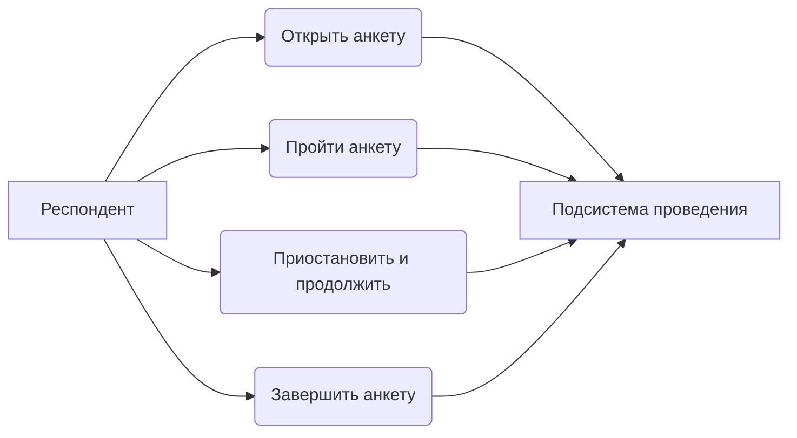
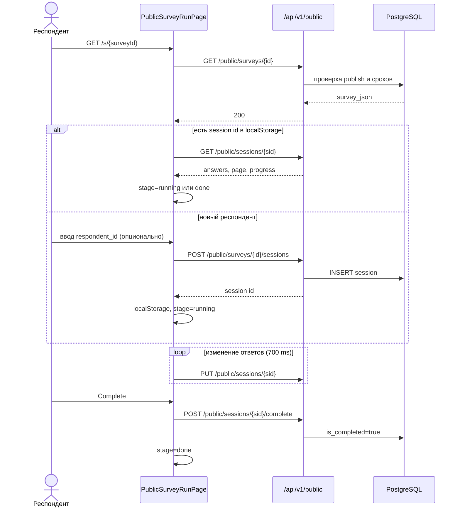
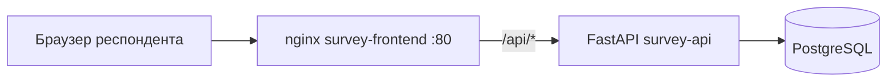

# Подсистема проведения анкетирования АСНИ социологических данных

*Фрагмент пояснительной записки к выпускной квалификационной работе (назначение, требования, диаграммы, описание интерфейса и программной реализации подсистемы).*

---

## 3. Подсистема проведения анкетирования

### 3.1. Назначение подсистемы и её место в архитектуре АСНИ

Подсистема проведения анкетирования берёт на себя всё, что происходит после публикации анкеты в конструкторе: загрузку схемы по идентификатору, экран для респондента, промежуточное сохранение ответов и фиксацию завершения.

Конструктор анкет и АРМ исследователя сюда не входят. Подсистема получает готовый `survey_json` и работает с сессией в таблице `survey_sessions`; статистика и выгрузка для исследователя идут через защищённые маршруты `/api/v1/surveys/...`, которые реализованы в том же backend, но вызываются из административного интерфейса конструктора.

В текущей реализации:

- интерактивное прохождение с ветвлением по логике SurveyJS на клиенте;
- пауза и продолжение в рамках одного браузера (`localStorage` + серверные autosave);
- прогресс в процентах и номер страницы на сервере;
- проверка сроков, лимита завершённых ответов и флага анонимности;
- брендированный интерфейс ННГУ, русская локализация форм, светлая/тёмная тема;
- минимальная PWA-оболочка (manifest + service worker в production);
- встраивание в оболочку АСНИ через Module Federation (маршрут `/s/:surveyId` внутри remote `surveyConstructor`).

---

### 3.2. Требования к подсистеме проведения анкетирования

#### 3.2.1. Функциональные требования

Обозначения: О — обязательное, Ж — желательное, В — возможное.

Таблица 3.1 — Функциональные требования

| ID | Формулировка требования | Приоритет |
|----|-------------------------|-----------|
| П.1.01 | Респондент открывает анкету по ссылке `/s/{survey_id}`; анкета видна только если `is_published=true` | О |
| П.1.02 | При первом старте создаётся сессия; её UUID сохраняется в `localStorage` (`survey_session_{surveyId}`) | О |
| П.1.03 | При повторном открытии в том же браузере восстанавливаются ответы, страница и прогресс из `GET /public/sessions/{id}` | О |
| П.1.04 | Ответы сохраняются на сервер при изменении полей и при смене страницы (debounce 700 мс) | Ж |
| П.1.05 | По завершении анкеты сессия помечается завершённой, `progress_pct=100` | О |
| П.1.06 | Ветвление и условия показа исполняются SurveyJS Runner на клиенте | О |
| П.1.07 | Завершённые и незавершённые сессии доступны исследователю через админский API | Ж |
| П.1.08 | Прогресс (доля заполненных видимых вопросов) пересчитывается на клиенте и уходит на сервер | Ж |
| П.1.09 | Номер текущей страницы сохраняется для восстановления позиции | Ж |
| П.1.10 | При достижении `max_responses` (по числу **завершённых** сессий) новая сессия не создаётся (HTTP 403) | О |
| П.1.11 | Если `allow_anonymous=false`, без `respondent_id` сессия не стартует (проверка на клиенте и 400 на сервере) | О |
| П.1.12 | При истечении срока проведения сохранение прогресса блокируется (HTTP 403) | Ж |
| П.1.13 | На экране до старта респондент может ввести необязательный или обязательный идентификатор | Ж |
| П.1.14 | После завершения доступна кнопка «Пройти заново» (новая сессия, очистка `localStorage`) | В |
| П.1.15 | Отдельные экраны для «анкета ещё не началась» и «срок истёк» (см. ограничения §3.8) | В |

#### 3.2.2. Нефункциональные требования

Таблица 3.2 — Нефункциональные требования

| ID | Формулировка | Приоритет |
|----|----------------|-----------|
| П.2.01 | Маршруты `/api/v1/public/*` не требуют JWT | О |
| П.2.02 | В продакшене тот же origin для UI и API (nginx проксирует `/api`) | Ж |
| П.2.03 | Debounce autosave 700 мс для снижения числа запросов | В |
| П.2.04 | Светлая/тёмная тема MUI и SurveyJS; `theme_mode` в `localStorage` | В |
| П.2.05 | Русская локализация текста SurveyJS (`locale = "ru"`) | Ж |
| П.2.06 | Manifest и service worker для офлайн-оболочки статики (production) | В |

---

### 3.3. Диаграмма прецедентов

Рисунок 3.1 — Диаграмма прецедентов подсистемы проведения

---

### 3.4. Диаграмма последовательности (основной сценарий)

Рисунок 3.2 — Последовательность прохождения анкеты

---

### 3.5. Описание программной реализации

#### 3.5.1. Клиентский модуль (`frontend/`)

**Страница прохождения** (`PublicSurveyRunPage.tsx`). Маршрут `/s/:surveyId`. Стадии (`stage`):

| Стадия | Когда показывается |
|--------|-------------------|
| `identify` | Нет сохранённой сессии; форма старта с заголовком, описанием, сроком, полем `respondent_id` |
| `running` | Активная сессия; SurveyJS Runner с `showProgressBar: "top"` |
| `done` | `is_completed=true` или только что отправлен `complete` |
| `expired` | Задумано при HTTP 410 (см. §3.8) |
| `not_started` | Задумано при `detail.code === "survey_not_started"` (см. §3.8) |

Загрузка: `GET /public/surveys/{surveyId}`. Если в `localStorage` есть UUID, `GET /public/sessions/{id}` — подстановка `model.data`, `currentPageNo`, `progress_pct`, подключение hooks `onValueChanged`, `onCurrentPageChanged`, `onComplete`.

**Autosave.** `scheduleSave` с таймером 700 мс отправляет `PUT /public/sessions/{id}` с `answers_json`, `current_page`, `progress_pct`. Прогресс на клиенте: доля непустых **видимых** вопросов (`getAllQuestions(false)`). Над формой — `LinearProgress` MUI; у SurveyJS — своя полоса сверху.

**Старт сессии.** `POST /public/surveys/{surveyId}/sessions` с `{ respondent_id }`. Перед запросом клиент проверяет `allow_anonymous`. При 403 с текстом про лимит ответов показывается сообщение об ошибке (отдельного экрана «лимит исчерпан» нет).

**Тема и бренд.** Шапка с `UnnLogo`, подпись «Анкетирование · ННГУ», переключатель темы. CSS-переменные SurveyJS (`DefaultLight`/`DefaultDark`) патчатся под `#003399`. `surveyLocalization.currentLocale = "ru"`.

**PWA.** `index.html` подключает `manifest.webmanifest`. В `main.tsx` в production регистрируется `public/sw.js`: кэш статики, network-first для навигации. Пакет `vite-plugin-pwa` в зависимостях есть, но в `vite.config.ts` не подключён — используется свой SW.

**Оболочка.** Тот же `App.tsx`, что и у конструктора; federation remote `surveyConstructor` экспортирует `./App`, поэтому публичный маршрут доступен и в автономном деплое, и внутри shell АСНИ.

**Вспомогательные модули.** `publicSurveyLink.ts` — URL `/s/{id}` для копирования из админки. `api.ts` — типы `PublicSurvey`, `Session` (без `max_responses` в ответе public GET).

#### 3.5.2. Серверный модуль (`backend/`)

**Публичные маршруты** (`app/api/v1/public.py`), без JWT:

| Метод | Путь | Назначение |
|-------|------|------------|
| `GET` | `/public/surveys/{survey_id}` | Опубликованная анкета + `survey_json` |
| `POST` | `/public/surveys/{survey_id}/sessions` | Создание сессии |
| `GET` | `/public/sessions/{session_id}` | Чтение сессии |
| `PUT` | `/public/sessions/{session_id}` | Autosave |
| `POST` | `/public/sessions/{session_id}/complete` | Завершение |

Тело `GET /public/surveys/{id}`: `id`, `title`, `description`, `survey_json`, `version`, `start_date`, `end_date`, `starts_at`, `ends_at`, `allow_anonymous`. Поле `max_responses` респонденту не отдаётся (лимит проверяется только при `POST` sessions).

**`SurveyService.get_public_survey`**. Неопубликованные → 404. До начала окна (`max` из `starts_at`/`start_date`) → 403, строка `"Survey has not started yet"`. После конца (`min` из `ends_at`/`end_date`) → 403, `"Survey has ended"`.

**`SessionService`** (`session_service.py`):

- `start_session` — проверка доступности анкеты, лимита завершённых (`max_responses` → 403), `allow_anonymous` (нет id → 400).
- `save_progress` — отказ для завершённой сессии (400), валидация `answers_json` (объект со строковыми ключами), проверка сроков анкеты (403), обновление `current_page`, `progress_pct`, `last_saved_at`.
- `complete_session` — запись финальных ответов, `is_completed=true`, `progress_pct=100`, `completed_at`; **повторная проверка срока на complete в текущем коде не выполняется**.

**Модель `survey_sessions`** (`models/session.py`): `survey_id` (CASCADE), `respondent_id`, `answers_json`, `is_completed`, `completed_at`, `current_page`, `progress_pct`, `last_saved_at`.

**Связь с конструктором.** Исследователь смотрит те же сессии через `GET /surveys/{id}/sessions` и агрегаты `GET /surveys/{id}/stats`; выгрузка — `GET /surveys/{id}/export`.

#### 3.5.3. Развёртывание и доступ

В production респондент ходит на `survey-frontend` (nginx `:80`): статика SPA + `location /api/` → `survey-api:8000`. JWT для публичных путей не нужен. В dev удобнее Vite `:5173` с прокси `/api` → `:8001`.

`GET /api/v1/info` объявляет capability `survey-respond` для родительской системы.

#### 3.5.4. E2E-тестирование

| Скрипт | Сценарий |
|--------|----------|
| `e2e_public_flow.py` | Старт → два PUT с разным прогрессом → complete → проверка через public GET и админский список |
| `e2e_stats_and_export.py` | Три сессии, `/stats`, экспорт JSON/CSV, `anonymize=true` |

Сроки, `not_started` и исчерпание лимита в E2E отдельно не покрыты.

---

### 3.6. Взаимодействие с подсистемой-конструктором

Конструктор задаёт `survey_json`, публикует анкету и выставляет `starts_at`, `ends_at`, `start_date`, `end_date`, `max_responses`, `allow_anonymous`. Подсистема проведения только читает эти поля и пишет строки в `survey_sessions`. После изменения схемы в конструкторе уже открытые сессии продолжают хранить старые `answers_json` — версионирование ответов по волнам опроса в MVP не делается.

---

### 3.7. Диаграмма размещения (упрощённо)

Рисунок 3.3 — Путь запроса респондента в Docker Compose

---

### 3.8. Ограничения и допущения (MVP)

**Сессия привязана к браузеру.** Смена устройства или очистка `localStorage` не даёт продолжить тот же черновик без отдельного механизма (magic link, код респондента и т.п.).

**Один активный черновик на анкету в браузере.** После «Пройти заново» создаётся новая сессия.

**Коды ошибок сроков.** Backend отдаёт 403 и текстовый `detail`, а не 410. Стадия `expired` в UI срабатывает только при статусе 410, поэтому на практике пользователь чаще видит Alert с текстом «Survey has ended», а не отдельную страницу `expired`.

**Экран «ещё не началось».** Frontend ожидает JSON с `code: "survey_not_started"` и датами; сервер пока отвечает строкой `"Survey has not started yet"`. Полноценный экран `not_started` с автоопросом раз в 15 с заложен в коде, но без доработки API редко включается.

**Лимит ответов.** Респондент узнаёт о лимите только при ошибке создания сессии, не заранее на карточке анкеты.

**Complete без повторной проверки срока.** Теоретически завершение возможно после закрытия окна, если сессия уже открыта; для строгого закрытия нужна доработка `complete_session`.

**Нет отдельного мобильного приложения.** Достаточно браузера; PWA кэширует оболочку, но не гарантирует офлайн-отправку ответов.

---

*Конец фрагмента. Номера рисунков и таблиц при вставке в пояснительную записку привести к сквозной нумерации. Диаграммы Mermaid — https://mermaid.live.*
