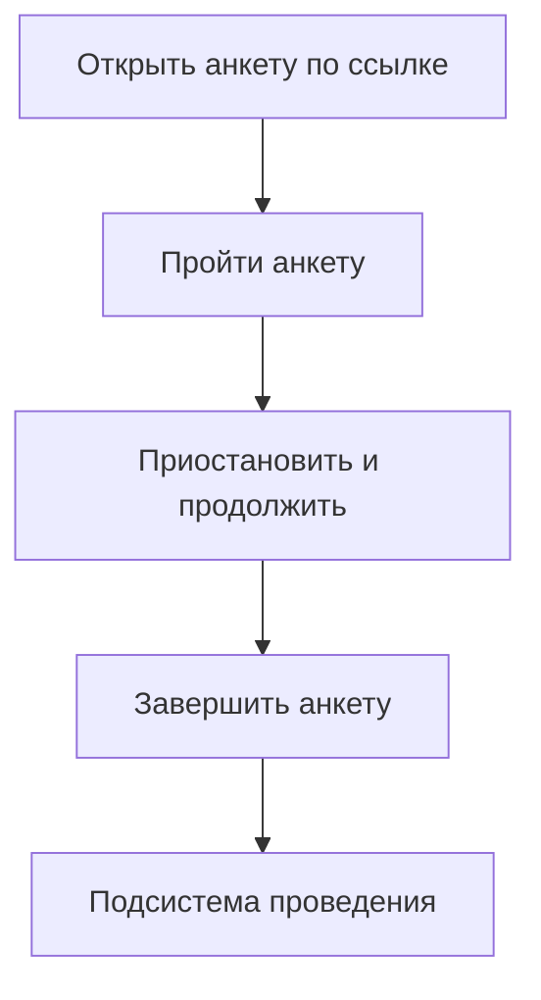
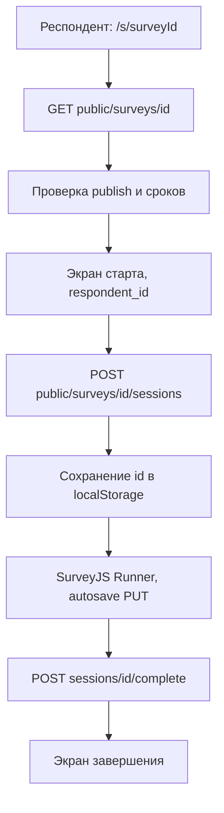
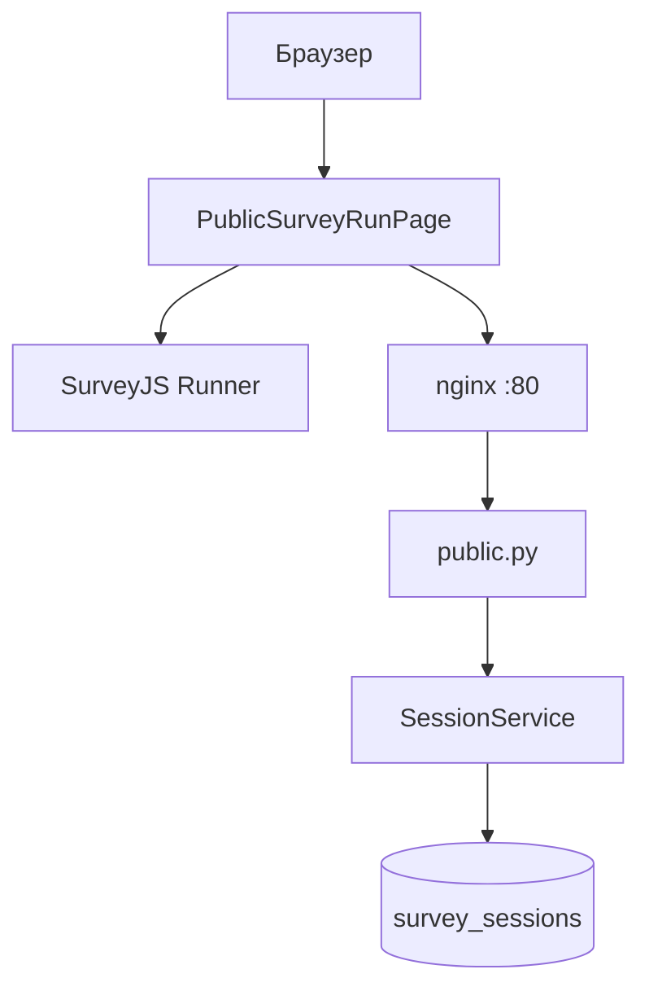

# Подсистема проведения анкетирования АСНИ социологических данных

Фрагмент пояснительной записки к выпускной квалификационной работе: назначение, требования, диаграммы, описание интерфейса и программной реализации подсистемы.

---

## 3. Подсистема проведения анкетирования

### 3.1. Назначение подсистемы и её место в архитектуре АСНИ

Подсистема проведения анкетирования берёт на себя всё, что происходит после публикации анкеты в конструкторе: загрузку схемы по идентификатору, экран для респондента, промежуточное сохранение ответов и фиксацию завершения.

Конструктор анкет и АРМ исследователя сюда не входят. Подсистема получает готовый survey_json и работает с записью сессии в таблице survey_sessions. Статистика и выгрузка для исследователя идут через защищённые маршруты /api/v1/surveys/..., но вызываются из административного интерфейса конструктора, а не с публичной страницы.

В реализованном прототипе есть следующее. Интерактивное прохождение: ветвление и скрытие вопросов по правилам SurveyJS на клиенте. Пауза и продолжение в рамках одного браузера: UUID сессии в localStorage и autosave на сервер. На сервер уходят процент прогресса и номер страницы. Проверяются сроки проведения, лимит завершённых ответов max_responses и флаг allow_anonymous. Интерфейс с логотипом ННГУ, русским текстом форм, переключением светлой и тёмной темы. В production подключены manifest и свой service worker для кэша статики. Тот же фронтенд отдаётся как Module Federation remote surveyConstructor, маршрут /s/:surveyId доступен и в автономном деплое, и внутри оболочки АСНИ.

---

### 3.2. Требования к подсистеме проведения анкетирования

#### 3.2.1. Функциональные требования

Обозначения: О обязательное, Ж желательное, В возможное.

Таблица 3.1. Функциональные требования

| ID | Формулировка требования | Приоритет |
|----|-------------------------|-----------|
| П.1.01 | Респондент открывает анкету по ссылке /s/{survey_id}; анкета видна только если is_published=true | О |
| П.1.02 | При первом старте создаётся сессия; UUID сохраняется в localStorage (ключ survey_session_{surveyId}) | О |
| П.1.03 | При повторном открытии в том же браузере восстанавливаются ответы, страница и прогресс из GET /public/sessions/{id} | О |
| П.1.04 | Ответы сохраняются на сервер при изменении полей и при смене страницы; debounce 700 мс | Ж |
| П.1.05 | По завершении сессия помечается завершённой, progress_pct=100 | О |
| П.1.06 | Ветвление и условия показа исполняются SurveyJS Runner на клиенте | О |
| П.1.07 | Завершённые и незавершённые сессии доступны исследователю через админский API | Ж |
| П.1.08 | Прогресс как доля заполненных видимых вопросов пересчитывается на клиенте и уходит на сервер | Ж |
| П.1.09 | Номер текущей страницы сохраняется для восстановления позиции | Ж |
| П.1.10 | При достижении max_responses по числу завершённых сессий новая сессия не создаётся (HTTP 403) | О |
| П.1.11 | Если allow_anonymous=false, без respondent_id сессия не стартует (клиент и 400 на сервере) | О |
| П.1.12 | При истечении срока сохранение прогресса блокируется (HTTP 403) | Ж |
| П.1.13 | На экране до старта респондент может ввести необязательный или обязательный идентификатор | Ж |
| П.1.14 | После завершения доступна кнопка Пройти заново: новая сессия, очистка localStorage | В |
| П.1.15 | Отдельные экраны для раннего старта и истечения срока (см. п. 3.8) | В |

#### 3.2.2. Нефункциональные требования

Таблица 3.2. Нефункциональные требования

| ID | Формулировка | Приоритет |
|----|----------------|-----------|
| П.2.01 | Маршруты /api/v1/public/* не требуют JWT | О |
| П.2.02 | В продакшене один origin для UI и API: nginx проксирует /api | Ж |
| П.2.03 | Debounce autosave 700 мс для снижения числа запросов | В |
| П.2.04 | Светлая и тёмная тема MUI и SurveyJS; theme_mode в localStorage | В |
| П.2.05 | Русская локализация SurveyJS (locale ru) | Ж |
| П.2.06 | Manifest и service worker для офлайн-оболочки статики в production | В |

---

### 3.3. Диаграмма прецедентов

На рисунке 3.1 прецеденты в одной колонке, без широких ответвлений. Подпись к рисунку: актор респондент. Экспорт PNG: https://mermaid.live, ширина около 400 px.

Рисунок 3.1. Диаграмма прецедентов подсистемы проведения

Актор: респондент. Порядок блоков на рисунке только для узкой вёрстки; прецеденты можно выполнять не строго по этой цепочке.

Респондент не проходит авторизацию в АСНИ. Достаточно ссылки /s/{id}. Открытие загружает опубликованную анкету. Прохождение включает ответы, переходы между страницами и autosave. Приостановить можно закрыв вкладку: при возврате в том же браузере сессия подтянется с сервера. Завершение фиксирует ответы и закрывает сессию для редактирования.

---

### 3.4. Диаграмма последовательности (основной сценарий)

На рисунке 3.2 узкая цепочка шагов основного сценария (новая сессия). Ветка восстановления из localStorage в тексте ниже.

Рисунок 3.2. Последовательность прохождения анкеты

Если в localStorage уже есть id сессии, после шага B выполняется GET public/sessions/id и пропускаются D, E, F (сразу Runner).

Страница PublicSurveyRunPage сначала тянет анкету. Если в localStorage лежит UUID прошлой сессии, подгружается её состояние; иначе показывается экран identify и кнопка начала. После POST sessions Runner получает hooks: при каждом изменении ответа или страницы через 700 мс уходит PUT. Complete отправляет финальный answers_json и переводит UI в done.

---

### 3.5. Диаграмма компонентов

На рисунке 3.3 одна колонка: браузер, страница прохождения, nginx, API, таблица сессий. Для листа А4 книжной ориентации. Экспорт PNG: https://mermaid.live, ширина около 350–450 px.

Рисунок 3.3. Компоненты и размещение подсистемы проведения

Клиентская часть.

PublicSurveyRunPage.tsx на маршруте /s/:surveyId. Тип stage: identify, running, done, expired, not_started. При монтировании вызывается loadSurvey: GET /public/surveys/{surveyId}, разбор survey_json в Model SurveyJS, locale ru, showProgressBar top, progressBarType questions.

identify. Показываются title, description, срок end_date или ends_at. Поле respondent_id. Если allow_anonymous false, без ввода старт блокируется с сообщением на русском. Кнопка начала вызывает handleStart и POST sessions.

running. attachHooks вешает onValueChanged, onCurrentPageChanged, onComplete. scheduleSave с setTimeout 700 мс шлёт PUT с answers_json, current_page model.currentPageNo, progress_pct. updateProgress считает видимые вопросы через getAllQuestions(false). Над формой LinearProgress MUI. Ошибки autosave попадают в Alert.

done. Текст благодарности, имя респондента если было. Кнопка Пройти заново сбрасывает localStorage и stage identify.

expired и not_started. В коде заложены отдельные экраны. expired ждёт HTTP 410; backend сейчас отдаёт 403 с текстом Survey has ended, поэтому чаще срабатывает общий Alert. not_started ждёт JSON с code survey_not_started; сервер отдаёт строку Survey has not started yet, поэтому экран с таймером опроса раз в 15 с обычно не включается.

Тема. useThemeMode из ThemeContext, переключатель в шапке. applySurveyTheme патчит CSS-переменные DefaultLight и DefaultDark под цвет #003399 на элементе .sd-root-modern.

UnnLogo.tsx в шапке, подпись про анкетирование ННГУ.

PWA. manifest.webmanifest в index.html. main.tsx регистрирует /sw.js только в PROD: кэширует иконки и оболочку, navigation network-first.

App.tsx скрывает админский AppBar на pathname /s/.... Federation: тот же bundle, что у конструктора.

publicSurveyLink.ts формирует абсолютный URL /s/{id} для админки.

api.ts типы PublicSurvey без max_responses в ответе GET public survey.

Серверная часть.

app/api/v1/public.py без JWT.

| Метод | Путь | Назначение |
|-------|------|------------|
| GET | /public/surveys/{survey_id} | Опубликованная анкета и survey_json |
| POST | /public/surveys/{survey_id}/sessions | Создание сессии |
| GET | /public/sessions/{session_id} | Чтение сессии |
| PUT | /public/sessions/{session_id} | Autosave |
| POST | /public/sessions/{session_id}/complete | Завершение |

Ответ GET public survey: id, title, description, survey_json, version, start_date, end_date, allow_anonymous, starts_at, ends_at. max_responses респонденту не отдаётся.

SurveyService.get_public_survey. Неопубликованная 404. До начала окна 403 Survey has not started yet. После конца 403 Survey has ended. Учитываются обе пары дат: starts_at и start_date, ends_at и end_date.

SessionService.start_session. Сначала get_public_survey. Потом completed_response_count сравнивается с max_responses, при превышении 403. Если allow_anonymous false и respondent_id пустой, 400. Создаётся строка survey_sessions с пустым answers_json.

save_progress. Нельзя писать в завершённую сессию (400). answers_json валидируется как dict со строковыми ключами. Снова проверка сроков анкеты (403). Обновляются current_page, progress_pct, last_saved_at.

complete_session. Записывает answers_json, is_completed true, progress_pct 100, completed_at. Повторной проверки срока на complete в текущей версии нет.

Модель survey_sessions: survey_id с ON DELETE CASCADE, respondent_id до 100 символов, answers_json JSONB, is_completed, completed_at, current_page, progress_pct, last_saved_at, created_at, updated_at.

Связь с конструктором. Исследователь смотрит те же сессии через GET /surveys/{id}/sessions и GET /surveys/{id}/stats, выгружает GET /surveys/{id}/export.

Развёртывание. Респондент в production открывает порт 80 контейнера survey-frontend. nginx отдаёт index.html для SPA и проксирует /api на survey-api:8000. JWT не нужен. GET /api/v1/info объявляет capability survey-respond для родительской системы. В dev Vite 5173 с proxy /api на 8001.

E2E. e2e_public_flow.py: start, два PUT с разным progress_pct, complete, проверка через public GET и админский list sessions. e2e_stats_and_export.py: три сессии, stats, export с anonymize. Сроки и лимит в E2E отдельно не тестируются.

---

### 3.6. Взаимодействие с подсистемой-конструктором

Конструктор задаёт survey_json, выставляет is_published и поля проведения: starts_at, ends_at, start_date, end_date, max_responses, allow_anonymous. Подсистема проведения только читает их и пишет survey_sessions.

Если исследователь изменил схему после того, как люди уже отвечали, старые сессии хранят answers_json в старой разметке. Отдельного версионирования ответов по волнам опроса в MVP нет. Публичную ссылку копируют из AdminSurveysListPage или AdminSurveyEditorPage после publish.

---

### 3.7. Ограничения и допущения (MVP)

Сессия привязана к браузеру. Другой компьютер или очистка localStorage не восстановит черновик без отдельного механизма вроде персональной ссылки с токеном.

В одном браузере на анкету один активный черновик. После Пройти заново создаётся новая сессия.

Коды сроков. Backend отдаёт 403 и текстовый detail, не 410. Стадия expired в UI рассчитана на 410, на практике пользователь видит Alert с Survey has ended.

Экран ещё не началось. Frontend ждёт JSON с code survey_not_started. Сервер пока шлёт строку. Автоопрос раз в 15 с на not_started без доработки API почти не работает.

Лимит ответов. Респондент узнаёт о max_responses только при ошибке POST sessions, не на карточке анкеты.

Complete без повторной проверки срока. Теоретически можно завершить после закрытия окна, если сессия уже открыта.

PWA кэширует оболочку, но не гарантирует отправку ответов без сети.

Отдельного мобильного приложения нет, достаточно браузера.

---

Конец фрагмента. Номера рисунков и таблиц при вставке в пояснительную записку привести к сквозной нумерации. Диаграммы Mermaid экспортируются на https://mermaid.live.
