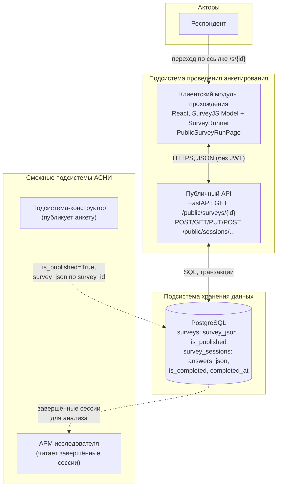

# Подсистема проведения анкетирования АСНИ социологических данных

*Фрагмент пояснительной записки к выпускной квалификационной работе (назначение, требования, диаграмма, описание интерфейса и программной реализации подсистемы).*

---

## 3. Подсистема проведения анкетирования

### 3.1. Назначение подсистемы и её место в архитектуре АСНИ

Подсистема проведения анкетирования отвечает за то, что происходит после того, как исследователь опубликовал анкету в конструкторе. Она загружает опубликованную анкету по идентификатору, предоставляет респонденту интерактивный интерфейс прохождения, сохраняет промежуточные ответы и фиксирует факт завершения.

Подсистема не занимается созданием и редактированием анкет — это зона ответственности конструктора. Также статистический анализ собранных ответов относится к АРМ исследователя. Граница чёткая: подсистема получает готовый `survey_json` и сессию, всё остальное выходит за её рамки.

Из требований на рисунке 3.1 (схема АСНИ) реализованы следующие функции:

- интерактивное прохождение анкеты с динамической адаптацией на основе логики, заложенной в `survey_json`;
- возможность приостановить заполнение и продолжить позже (сессионная модель);
- промежуточное хранение ответов до момента завершения.

Персонализация доступа реализована через поле `respondent_id`: перед началом прохождения респондент может ввести своё имя или другой идентификатор, который сохраняется вместе с сессией. Поле необязательное.

---

### 3.2. Требования к подсистеме проведения анкетирования

#### 3.2.1. Функциональные требования

Обозначения приоритетов: О — обязательное (Must), Ж — желательное (Should), В — возможное (Could).

Таблица 3.1 — Функциональные требования к подсистеме проведения анкетирования

| ID | Формулировка требования | Приоритет |
|----|-------------------------|-----------|
| П.1.01 | Респондент открывает анкету по публичной ссылке вида `/s/{survey_id}`; анкета отображается только если опубликована | О |
| П.1.02 | При открытии анкеты создаётся сессия прохождения и её идентификатор сохраняется в браузере | О |
| П.1.03 | Если в браузере уже есть идентификатор сессии для этой анкеты, подсистема восстанавливает ранее введённые ответы | О |
| П.1.04 | Ответы автоматически сохраняются на сервер при изменении значения любого вопроса и при переходе между страницами | Ж |
| П.1.05 | По завершении анкеты ответы фиксируются на сервере и сессия помечается как завершённая | О |
| П.1.06 | Динамическая логика анкеты (ветвление, условия показа вопросов) исполняется на стороне клиента средствами SurveyJS | О |
| П.1.07 | Завершённая сессия доступна исследователю для выгрузки через административный API | Ж |

#### 3.2.2. Нефункциональные требования

Таблица 3.2 — Нефункциональные требования

| ID | Формулировка | Приоритет |
|----|----------------|-----------|
| П.2.01 | Публичные маршруты прохождения не требуют авторизации | О |
| П.2.02 | Промежуточные ответы сохраняются с дебаунсом 700 мс, чтобы не создавать избыточной нагрузки на API | В |
| П.2.03 | Ответы хранятся в СУБД в виде JSONB, структура не фиксирована схемой | О |
| П.2.04 | Запись в завершённую сессию заблокирована на уровне API — повторная отправка ответов невозможна | О |

#### 3.2.3. Пользовательские сценарии

Сценарий A — первичное прохождение. Респондент переходит по ссылке `/s/{survey_id}`. Подсистема загружает опубликованную анкету, создаёт новую сессию и сохраняет её id в `localStorage`. Респондент заполняет вопросы; ответы автоматически отправляются на сервер после каждого изменения. По завершении сессия помечается как `is_completed=True`.

Сценарий B — возобновление прохождения. Респондент снова открывает ту же ссылку в том же браузере. В `localStorage` найден id предыдущей сессии — подсистема загружает сохранённые ответы и подставляет их в форму. Если сессия уже завершена, показывается соответствующее уведомление.

Сценарий C — анкета недоступна. Если анкета не опубликована или не существует, сервер возвращает 404 и пользователь видит сообщение об ошибке.

Сценарий D — срок проведения истёк. Исследователь может задать дату и время окончания приёма ответов (`end_date`) в редакторе анкеты. Если текущее время превышает `end_date`, сервер возвращает статус 410. Страница прохождения показывает сообщение «Срок проведения этой анкеты истёк. Приём ответов завершён» — без возможности начать или продолжить заполнение.

---

### 3.3. Структурная диаграмма подсистемы

Рисунок 3.1 — Структурная диаграмма подсистемы проведения анкетирования

На диаграмме показан клиентский модуль прохождения (`PublicSurveyRunPage`), который работает без авторизации. Респондент открывает страницу по публичной ссылке, клиент загружает анкету и управляет сессией через публичный API. Данные хранятся в двух таблицах PostgreSQL: `surveys` (берётся из конструктора, только поля `survey_json` и `is_published`) и `survey_sessions` (ответы, признак завершения). АРМ исследователя читает завершённые сессии через административный API конструктора.

---

### 3.4. Программная реализация подсистемы

#### 3.4.1. Клиентский модуль (`frontend/`)

`pages/PublicSurveyRunPage.tsx` — единственная страница подсистемы, доступная по маршруту `/s/:surveyId` без авторизации. Страница работает в трёх состояниях (`stage`): `identify`, `running`, `done`.

При загрузке вызывается `loadSurvey()`:

1. GET `/public/surveys/{surveyId}` — загружает опубликованную анкету и передаёт `survey_json` в SurveyJS-модель через `model.fromJSON()`. Если анкета не найдена или не опубликована, показывается ошибка.
2. В `localStorage` ищется ключ `survey_session_{surveyId}`. Если есть — делается GET `/public/sessions/{id}` для восстановления сессии. Завершённая сессия переводит страницу в состояние `done`, незавершённая восстанавливает ответы в `model.data` и переходит в `running`. Если ключа нет или сессия не найдена на сервере — открывается экран идентификации.

Состояние `identify` — форма с полем «Ваше имя или идентификатор» (необязательное) и кнопкой «Начать анкетирование». По нажатию `handleStart()` создаёт сессию через POST `/public/surveys/{surveyId}/sessions`, передавая `respondent_id` (строка или `null`), сохраняет id сессии в `localStorage` и переходит в `running`.

Состояние `running` — отображает компонент `SurveyRunner`. Функция `attachHooks(sessionId)` подключает обработчики SurveyJS:
- `onValueChanged` и `onCurrentPageChanged` — вызывают `scheduleSave()`;
- `onComplete` — отправляет POST `/public/sessions/{id}/complete` с финальными ответами и переводит страницу в `done`.

Состояние `done` — страница с подтверждением завершения, именем участника (если было указано) и кнопкой «Пройти заново». `handleRestart()` удаляет ключ из `localStorage`, сбрасывает состояние и возвращает страницу в `identify`.

`scheduleSave(sessionId)` — дебаунсированное автосохранение с задержкой 700 мс. Отправляет PUT `/public/sessions/{id}` с текущим `model.data`. При ошибке в MVP-версии ошибка молча игнорируется.

Состояние `expired` — отображается, если сервер вернул статус 410 при загрузке анкеты или создании сессии. Показывает сообщение об истечении срока без возможности начать прохождение.

#### 3.4.2. Серверный модуль (`backend/`)

`app/api/v1/public.py` — все маршруты публичного API, JWT не требуется.

- GET `/public/surveys/{survey_id}` (`get_public_survey`) — возвращает анкету только если `is_published=True` и срок не истёк. При истечении срока возвращает 410. Поля ответа включают `end_date`.
- POST `/public/surveys/{survey_id}/sessions` (`start_session`) — создаёт сессию; перед созданием вызывает `_check_survey_available`, которая проверяет публикацию и срок. При истёкшем `end_date` — 410.
- GET `/public/sessions/{session_id}` (`get_session`) — возвращает сессию по UUID или 404.
- PUT `/public/sessions/{session_id}` (`save_progress`) — обновляет `answers_json`. Запись в завершённую сессию заблокирована (ответ 400). Перед сохранением вызывается `_validate_answers`: проверяет, что переданный объект — это словарь со строковыми ключами.
- POST `/public/sessions/{session_id}/complete` (`complete_session`) — записывает финальные ответы и выставляет `is_completed=True`.

`app/models/session.py` — ORM-модель таблицы `survey_sessions`:

Модель `Survey` дополнена полем `end_date` (DateTime с часовым поясом, опциональное). Исследователь задаёт его в редакторе анкеты через поле «Срок проведения». Поле сохраняется отдельной кнопкой «Сохранить срок» и отображается в строке под редактором.

- `survey_id` — внешний ключ на `surveys.id`, с `ondelete="CASCADE"` (при удалении анкеты сессии удаляются вместе с ней);
- `respondent_id` — строка до 100 символов, опциональная;
- `answers_json` — JSONB, ответы в виде словаря;
- `is_completed` — булево;
- `completed_at` — timestamp с часовым поясом, заполняется методом `mark_completed()`.

`app/schemas/session.py` — Pydantic-схемы: `SessionCreate` (только `respondent_id`), `SessionSave` и `SessionComplete` (только `answers_json`), `SessionOut` (полная запись для ответа клиенту).

---

### 3.5. Ограничения и допущения текущей версии (MVP)

Привязка сессии к браузеру через `localStorage` означает, что при смене устройства или очистке хранилища незавершённая сессия не восстанавливается — это допущение MVP. В рамках одного браузера одновременно может быть только одна активная сессия для данной анкеты, однако после завершения доступна кнопка «Пройти заново», которая создаёт новую сессию.

---

*Конец фрагмента. Номера рисунков и таблиц при вставке в пояснительную записку привести к сквозной нумерации документа. Диаграмму Mermaid можно экспортировать в PNG/SVG на https://mermaid.live для включения в PDF.*
