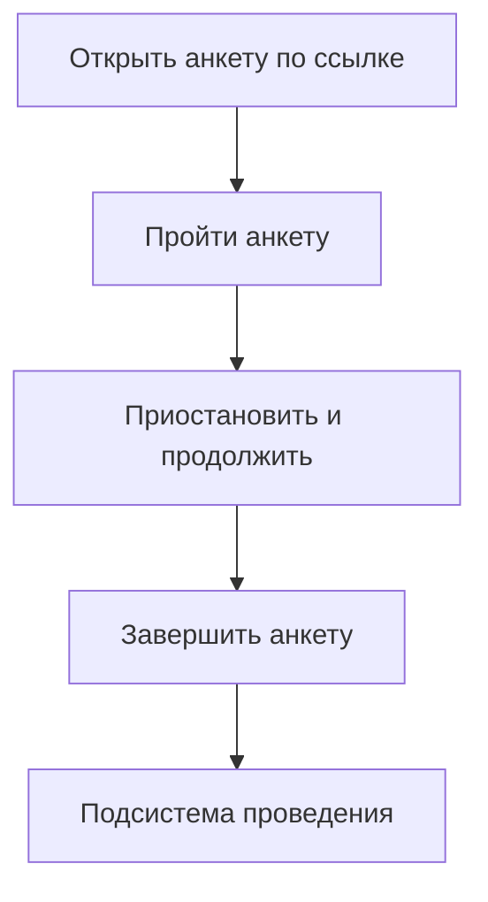
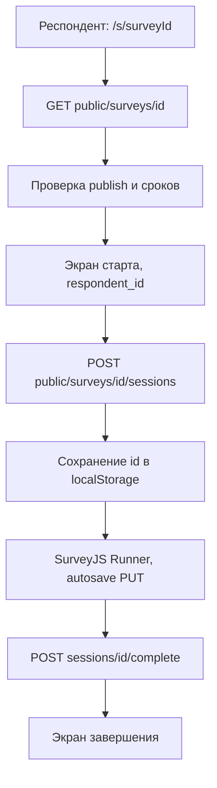
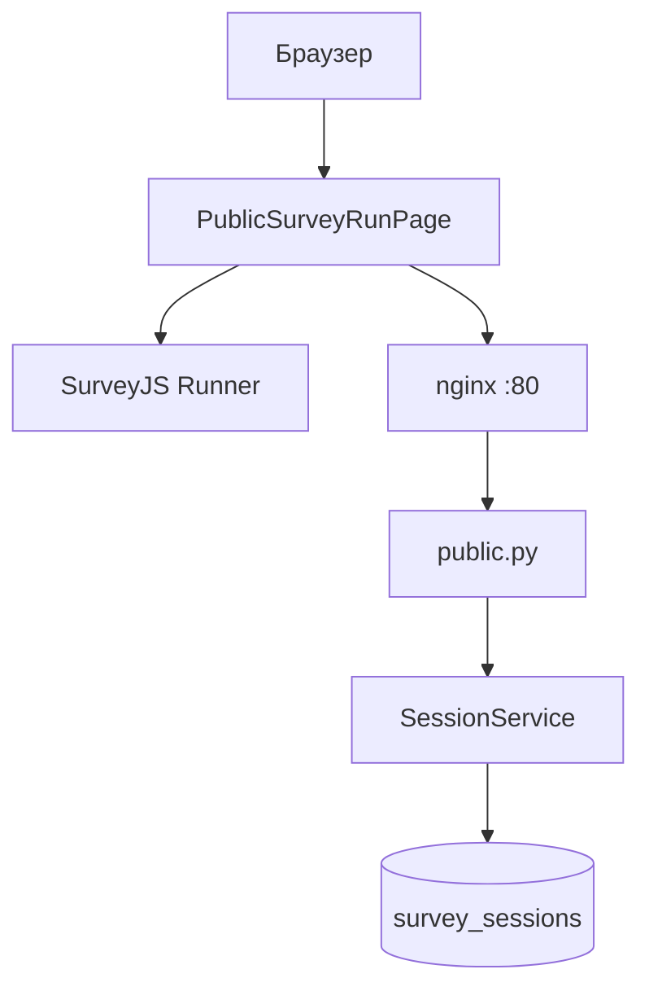

# Подсистема проведения анкетирования АСНИ социологических данных

Фрагмент пояснительной записки к выпускной квалификационной работе: назначение, требования, диаграммы, описание интерфейса и программной реализации подсистемы.

---

## 3. Подсистема проведения анкетирования

### 3.1. Назначение подсистемы и её место в архитектуре АСНИ

Подсистема проведения анкетирования берёт на себя всё, что происходит после публикации анкеты в конструкторе: загрузку схемы по идентификатору, экран для респондента, промежуточное сохранение ответов и фиксацию завершения.

Конструктор анкет и АРМ исследователя сюда не входят. Подсистема получает готовый survey_json и работает с записью сессии в таблице survey_sessions. Статистика и выгрузка для исследователя идут через защищённые маршруты /api/v1/surveys/..., но вызываются из административного интерфейса конструктора, а не с публичной страницы.

В реализованном прототипе есть следующее. Интерактивное прохождение: ветвление и скрытие вопросов по правилам SurveyJS на клиенте. Пауза и продолжение в рамках одного браузера: UUID сессии в localStorage и autosave на сервер. На сервер уходят процент прогресса и номер страницы. Проверяются сроки проведения, лимит завершённых ответов max_responses и флаг allow_anonymous. Интерфейс с логотипом ННГУ, русским текстом форм, переключением светлой и тёмной темы. В production подключены manifest и свой service worker для кэша статики. Тот же фронтенд отдаётся как Module Federation remote surveyConstructor, маршрут /s/:surveyId доступен и в автономном деплое, и внутри оболочки АСНИ.

---

### 3.2. Требования к подсистеме проведения анкетирования

#### 3.2.1. Функциональные требования

Обозначения: О обязательное, Ж желательное, В возможное.

Таблица 3.1. Функциональные требования

| ID | Формулировка требования | Приоритет |
|----|-------------------------|-----------|
| П.1.01 | Респондент открывает анкету по ссылке /s/{survey_id}; анкета видна только если is_published=true | О |
| П.1.02 | При первом старте создаётся сессия; UUID сохраняется в localStorage (ключ survey_session_{surveyId}) | О |
| П.1.03 | При повторном открытии в том же браузере восстанавливаются ответы, страница и прогресс из GET /public/sessions/{id} | О |
| П.1.04 | Ответы сохраняются на сервер при изменении полей и при смене страницы; debounce 700 мс | Ж |
| П.1.05 | По завершении сессия помечается завершённой, progress_pct=100 | О |
| П.1.06 | Ветвление и условия показа исполняются SurveyJS Runner на клиенте | О |
| П.1.07 | Завершённые и незавершённые сессии доступны исследователю через админский API | Ж |
| П.1.08 | Прогресс как доля заполненных видимых вопросов пересчитывается на клиенте и уходит на сервер | Ж |
| П.1.09 | Номер текущей страницы сохраняется для восстановления позиции | Ж |
| П.1.10 | При достижении max_responses по числу завершённых сессий новая сессия не создаётся (HTTP 403) | О |
| П.1.11 | Если allow_anonymous=false, без respondent_id сессия не стартует (клиент и 400 на сервере) | О |
| П.1.12 | При истечении срока сохранение прогресса блокируется (HTTP 403) | Ж |
| П.1.13 | На экране до старта респондент может ввести необязательный или обязательный идентификатор | Ж |
| П.1.14 | После завершения доступна кнопка Пройти заново: новая сессия, очистка localStorage | В |
| П.1.15 | Отдельные экраны для раннего старта и истечения срока (см. п. 3.8) | В |

#### 3.2.2. Нефункциональные требования

Таблица 3.2. Нефункциональные требования

| ID | Формулировка | Приоритет |
|----|----------------|-----------|
| П.2.01 | Маршруты /api/v1/public/* не требуют JWT | О |
| П.2.02 | В продакшене один origin для UI и API: nginx проксирует /api | Ж |
| П.2.03 | Debounce autosave 700 мс для снижения числа запросов | В |
| П.2.04 | Светлая и тёмная тема MUI и SurveyJS; theme_mode в localStorage | В |
| П.2.05 | Русская локализация SurveyJS (locale ru) | Ж |
| П.2.06 | Manifest и service worker для офлайн-оболочки статики в production | В |

---

### 3.3. Диаграмма прецедентов

На рисунке 3.1 прецеденты в одной колонке, без широких ответвлений. Подпись к рисунку: актор респондент. Экспорт PNG: https://mermaid.live, ширина около 400 px.

Рисунок 3.1. Диаграмма прецедентов подсистемы проведения

Актор: респондент. Порядок блоков на рисунке только для узкой вёрстки; прецеденты можно выполнять не строго по этой цепочке.

Респондент не проходит авторизацию в АСНИ. Достаточно ссылки /s/{id}. Открытие загружает опубликованную анкету. Прохождение включает ответы, переходы между страницами и autosave. Приостановить можно закрыв вкладку: при возврате в том же браузере сессия подтянется с сервера. Завершение фиксирует ответы и закрывает сессию для редактирования.

---

### 3.4. Диаграмма последовательности (основной сценарий)

На рисунке 3.2 узкая цепочка шагов основного сценария (новая сессия). Ветка восстановления из localStorage в тексте ниже.

Рисунок 3.2. Последовательность прохождения анкеты

Если в localStorage уже есть id сессии, после шага B выполняется GET public/sessions/id и пропускаются D, E, F (сразу Runner).

Страница PublicSurveyRunPage сначала тянет анкету. Если в localStorage лежит UUID прошлой сессии, подгружается её состояние; иначе показывается экран identify и кнопка начала. После POST sessions Runner получает hooks: при каждом изменении ответа или страницы через 700 мс уходит PUT. Complete отправляет финальный answers_json и переводит UI в done.

---

### 3.5. Диаграмма компонентов

На рисунке 3.3 компоненты идут одной узкой колонкой: от браузера к API и таблице сессий. Так схема обычно помещается на лист А4 без поворота. Экспорт PNG: https://mermaid.live (ширина около 350–450 px).

Рисунок 3.3. Компоненты подсистемы проведения

Клиентская часть, каталог frontend/src.

PublicSurveyRunPage.tsx на маршруте /s/:surveyId. Переключатель stage: identify, running, done, expired, not_started. При открытии loadSurvey запрашивает GET /public/surveys/{surveyId}, поднимает Model SurveyJS (locale ru, прогресс по видимым вопросам).

На identify показывают заголовок, описание и срок. Поле respondent_id обязательно, если allow_anonymous=false. Старт вызывает POST /public/surveys/{id}/sessions и пишет UUID в localStorage (ключ survey_session_{surveyId}). Если ключ уже есть, сессия подгружается через GET /public/sessions/{id} и экран identify пропускается.

В running SurveyJS Runner с hooks onValueChanged и onCurrentPageChanged. scheduleSave с паузой 700 мс отправляет PUT с answers_json, current_page и progress_pct. Над анкетой LinearProgress. onComplete вызывает POST complete и переводит в done. Кнопка Пройти заново сбрасывает localStorage и stage.

Отдельные экраны expired и not_started в коде есть, но без доработки API редко показываются: сервер шлёт 403 со строкой, а не 410 и не JSON с code (подробнее в п. 3.7).

App.tsx на путях /s/* не показывает админский AppBar. ThemeContext, theme.ts и applySurveyTheme выравнивают MUI и SurveyJS под primary #003399. UnnLogo.tsx в шапке. manifest.webmanifest и service worker в production кэшируют статику; ответы без сети не уходят. Тот же bundle отдаётся как remote surveyConstructor. publicSurveyLink.ts и типы PublicSurvey в api.ts использует админка; max_responses в ответе public survey нет.

Серверная часть, каталог backend/app.

Роутер public.py без JWT: GET опубликованной анкеты, POST/GET/PUT сессии, POST complete.

SurveyService.get_public_survey: неопубликованная анкета даёт 404, до окна приёма и после конца 403 с текстом Survey has not started yet / Survey has ended. Сверяются starts_at со start_date и ends_at с end_date.

SessionService.start_session сначала вызывает get_public_survey, затем сравнивает число завершённых с max_responses (403 при лимите). Без respondent_id при allow_anonymous=false возвращает 400. save_progress не пишет в завершённую сессию, проверяет формат answers_json и сроки на каждом PUT. complete_session фиксирует ответы и is_completed=true; повторной проверки срока на complete пока нет.

Таблица survey_sessions (JSONB answers_json, progress_pct, current_page, respondent_id, CASCADE от surveys). Исследователь читает те же строки через маршруты конструктора: sessions, stats, export.

В production nginx в survey-frontend на :80 отдаёт SPA и проксирует /api на survey-api. В dev Vite на 5173 проксирует на 8001. GET /api/v1/info отдаёт capability survey-respond для оболочки АСНИ. В CI e2e_public_flow.py и e2e_stats_and_export.py проходят цикл сессии и выгрузку; сроки и лимит отдельно не гоняются.

---

### 3.6. Взаимодействие с подсистемой-конструктором

Конструктор задаёт survey_json, выставляет is_published и поля проведения: starts_at, ends_at, start_date, end_date, max_responses, allow_anonymous. Подсистема проведения только читает их и пишет survey_sessions.

Если исследователь изменил схему после того, как люди уже отвечали, старые сессии хранят answers_json в старой разметке. Отдельного версионирования ответов по волнам опроса в MVP нет. Публичную ссылку копируют из AdminSurveysListPage или AdminSurveyEditorPage после publish.

---

### 3.7. Ограничения и допущения (MVP)

Сессия привязана к браузеру. Другой компьютер или очистка localStorage не восстановит черновик без отдельного механизма вроде персональной ссылки с токеном.

В одном браузере на анкету один активный черновик. После Пройти заново создаётся новая сессия.

Коды сроков. Backend отдаёт 403 и текстовый detail, не 410. Стадия expired в UI рассчитана на 410, на практике пользователь видит Alert с Survey has ended.

Экран ещё не началось. Frontend ждёт JSON с code survey_not_started. Сервер пока шлёт строку. Автоопрос раз в 15 с на not_started без доработки API почти не работает.

Лимит ответов. Респондент узнаёт о max_responses только при ошибке POST sessions, не на карточке анкеты.

Complete без повторной проверки срока. Теоретически можно завершить после закрытия окна, если сессия уже открыта.

PWA кэширует оболочку, но не гарантирует отправку ответов без сети.

Отдельного мобильного приложения нет, достаточно браузера.

---

Конец фрагмента. Номера рисунков и таблиц при вставке в пояснительную записку привести к сквозной нумерации. Диаграммы Mermaid экспортируются на https://mermaid.live.
